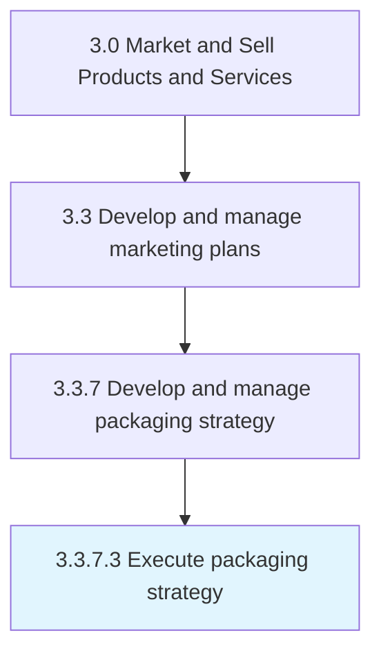

# Execute packaging strategy

> Implementing the final packaging.

## Overview

Activity 3.3.7.3 is an activity within the Market and Sell Products and Services framework. 

Implementing the final packaging. Put into action the packaging strategy in light of the insights accumulated from testing various options.

## Process Hierarchy



## Key Statistics

| Metric | Value |
|--------|-------|
| APQC Code | 10180 |
| Hierarchy ID | 3.3.7.3 |
| Level | Activity |
| Parent | [3.3.7](../) |
| Sub-Processes | 0 |


## GraphDL Semantic Structure

```
execute.PackagingStrategy
```

| Component | Value | Description |
|-----------|-------|-------------|
| Verb | `execute` | Primary action |
| Object | `packaging strategy` | Direct object |


## Related Concepts

- [PackagingStrategy](/concepts/PackagingStrategy)


---

*Source: APQC PCF 10180 (3.3.7.3) - APQC*
