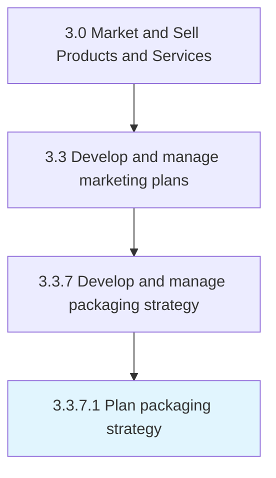

# Plan packaging strategy

> Creating a strategic road map for how to package products/services into desirable solutions while increasing profitability.

## Overview

Activity 3.3.7.1 is an activity within the Market and Sell Products and Services framework. 

Creating a strategic road map for how to package products/services into desirable solutions while increasing profitability. Create a scheme for how the organization will bundle and wrap its products/services into a presentable and sellable offering. Consider what aspects or components of an offering the organization can extract the maximum revenue from, and reduce the less profitable constituents while maintaining a high perceptible value for the customers. Balance maximizing profit with benefits to the customer.

## Process Hierarchy



## Key Statistics

| Metric | Value |
|--------|-------|
| APQC Code | 10178 |
| Hierarchy ID | 3.3.7.1 |
| Level | Activity |
| Parent | [3.3.7](../) |
| Sub-Processes | 0 |


## GraphDL Semantic Structure

```
plan.PackagingStrategy
```

| Component | Value | Description |
|-----------|-------|-------------|
| Verb | `plan` | Primary action |
| Object | `packaging strategy` | Direct object |


## Related Concepts

- [PackagingStrategy](/concepts/PackagingStrategy)


---

*Source: APQC PCF 10178 (3.3.7.1) - APQC*
