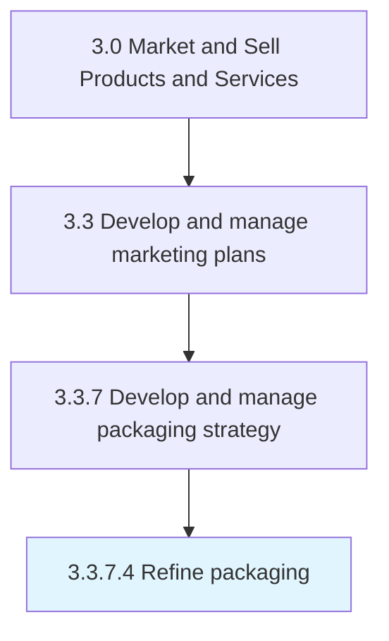

# Refine packaging

> Fine-tuning the packaging that has been developed and tested using insights gleaned from feedback.

## Overview

Activity 3.3.7.4 is an activity within the Market and Sell Products and Services framework. 

Fine-tuning the packaging that has been developed and tested using insights gleaned from feedback.

## Process Hierarchy



## Key Statistics

| Metric | Value |
|--------|-------|
| APQC Code | 10181 |
| Hierarchy ID | 3.3.7.4 |
| Level | Activity |
| Parent | [3.3.7](../) |
| Sub-Processes | 0 |


## GraphDL Semantic Structure

```
refine.Packaging
```

| Component | Value | Description |
|-----------|-------|-------------|
| Verb | `refine` | Primary action |
| Object | `packaging` | Direct object |


## Related Concepts

- [Packaging](/concepts/Packaging)


---

*Source: APQC PCF 10181 (3.3.7.4) - APQC*
