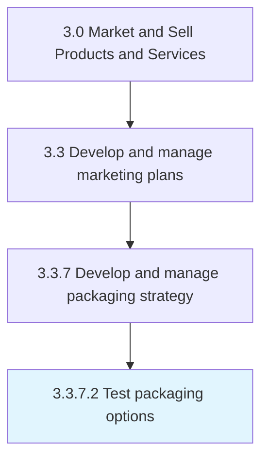

# Test packaging options

> Piloting the packaged products/services in the market with a test audience.

## Overview

Activity 3.3.7.2 is an activity within the Market and Sell Products and Services framework. 

Piloting the packaged products/services in the market with a test audience. Create trial runs using techniques such as focus groups of the final product, wrapped and bundled.

## Process Hierarchy



## Key Statistics

| Metric | Value |
|--------|-------|
| APQC Code | 10179 |
| Hierarchy ID | 3.3.7.2 |
| Level | Activity |
| Parent | [3.3.7](../) |
| Sub-Processes | 0 |


## GraphDL Semantic Structure

```
test.PackagingOptions
```

| Component | Value | Description |
|-----------|-------|-------------|
| Verb | `test` | Primary action |
| Object | `packaging options` | Direct object |


## Related Concepts

- [PackagingOptions](/concepts/PackagingOptions)


---

*Source: APQC PCF 10179 (3.3.7.2) - APQC*
