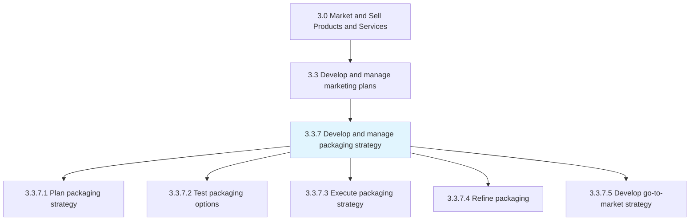
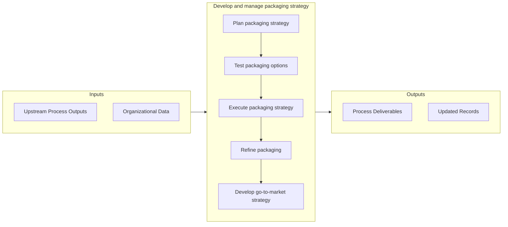

# Develop and manage packaging strategy

> Creating, executing, and administering a strategic road map for packaging products/services.

## Overview

Process 3.3.7 is a core process that defines the specific procedures for develop and manage packaging strategy. 

Creating, executing, and administering a strategic road map for packaging products/services. Determine how to package products/services into finished offerings that can be directly marketed to prospective customers. Consider physicality, perishability, and shelf-life. Develop a strategy for packaging products/services. Test alternatives. Collect feedback. Refine the option chosen for execution. Have marketing, product development, and supply chain functions work together to develop sound packaging.

## Process Hierarchy



## Key Statistics

| Metric | Value |
|--------|-------|
| APQC Code | 10154 |
| Hierarchy ID | 3.3.7 |
| Level | Process |
| Parent | [3.3](../) |
| Sub-Processes | 5 |


## GraphDL Semantic Structure

```
develop.AndManagePackagingStrategy
```

| Component | Value | Description |
|-----------|-------|-------------|
| Verb | `develop` | Primary action |
| Object | `and manage packaging strategy` | Direct object |


## Process Flow



## Sub-Processes

| Process | Hierarchy ID | Description |
|---------|-------------|-------------|
| [Plan packaging strategy](./PlanPackagingStrategy) | 3.3.7.1 | Creating a strategic road map for how to package products/services into desirable solutions while in |
| [Test packaging options](./TestPackagingOptions) | 3.3.7.2 | Piloting the packaged products/services in the market with a test audience |
| [Execute packaging strategy](./ExecutePackagingStrategy) | 3.3.7.3 | Implementing the final packaging |
| [Refine packaging](./RefinePackaging) | 3.3.7.4 | Fine-tuning the packaging that has been developed and tested using insights gleaned from feedback |
| [Develop go-to-market strategy](./DevelopGotomarketStrategy) | 3.3.7.5 | Creation of a plan detailing how a company plans to execute a successful product release and promoti |


## Related Concepts

- PackagingStrategy
- PackagingStrategy


---

*Source: APQC PCF 10154 (3.3.7) - APQC*
