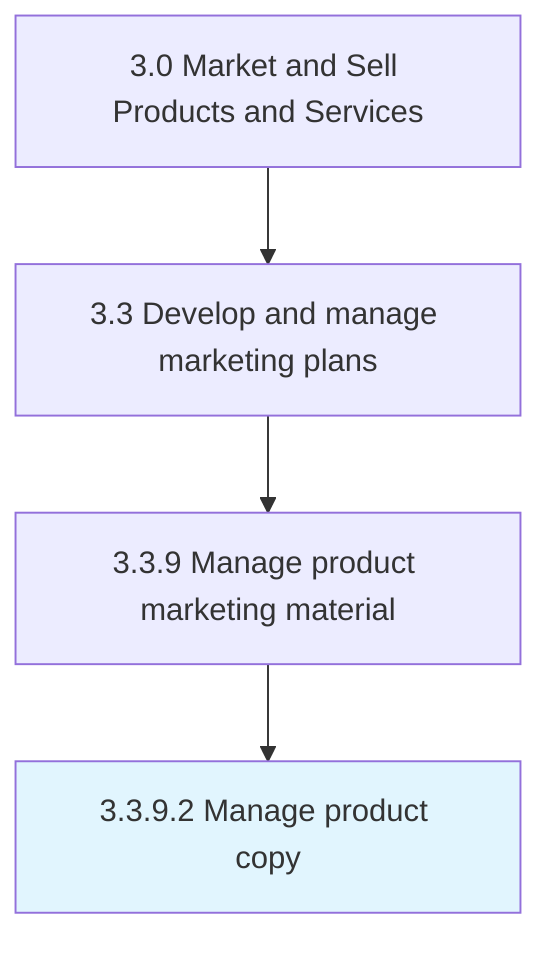

# Manage product copy

> Authoring or overseeing the creation of the textual portion of a product description, advertisement, or web page, including the headline, body, product attributes, and brand or advertiser information.

## Overview

Activity 3.3.9.2 is an activity within the Market and Sell Products and Services framework. 

Authoring or overseeing the creation of the textual portion of a product description, advertisement, or web page, including the headline, body, product attributes, and brand or advertiser information. A copy is designed to provide information about the product and to catch and hold the interest of prospective buyers long enough to persuade them to make a purchase. The copy of a website is called its content.

## Process Hierarchy



## Key Statistics

| Metric | Value |
|--------|-------|
| APQC Code | 18130 |
| Hierarchy ID | 3.3.9.2 |
| Level | Activity |
| Parent | [3.3.9](../) |
| Sub-Processes | 0 |


## GraphDL Semantic Structure

```
manage.ProductCopy
```

| Component | Value | Description |
|-----------|-------|-------------|
| Verb | `manage` | Primary action |
| Object | `product copy` | Direct object |


## Related Concepts

- ProductCopy


---

*Source: APQC PCF 18130 (3.3.9.2) - APQC*
