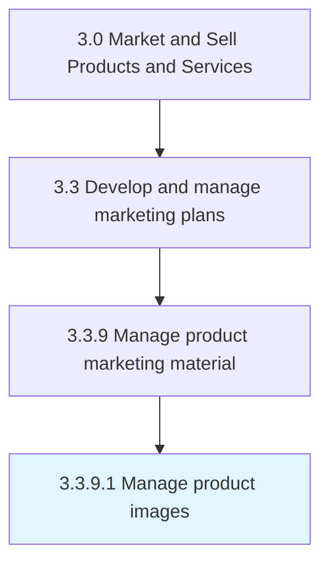

# Manage product images

> Producing or overseeing the creation or acquisition of photos, images and graphics for a product description, advertisement or a website.

## Overview

Activity 3.3.9.1 is an activity within the Market and Sell Products and Services framework. 

Producing or overseeing the creation or acquisition of photos, images and graphics for a product description, advertisement or a website. Like the copy [18131], product images are chosen and edited to enhance the product description and to convince consumers to purchase the product.

## Process Hierarchy



## Key Statistics

| Metric | Value |
|--------|-------|
| APQC Code | 16630 |
| Hierarchy ID | 3.3.9.1 |
| Level | Activity |
| Parent | [3.3.9](../) |
| Sub-Processes | 0 |


## GraphDL Semantic Structure

```
manage.ProductImages
```

| Component | Value | Description |
|-----------|-------|-------------|
| Verb | `manage` | Primary action |
| Object | `product images` | Direct object |


## Related Concepts

- ProductImages


---

*Source: APQC PCF 16630 (3.3.9.1) - APQC*
