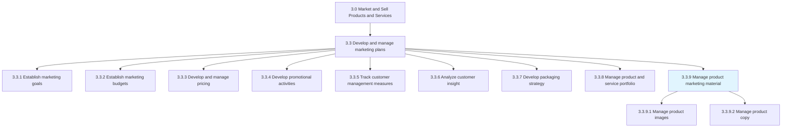
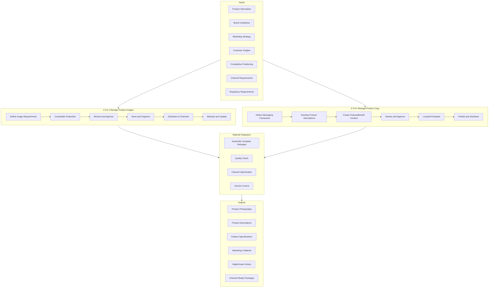
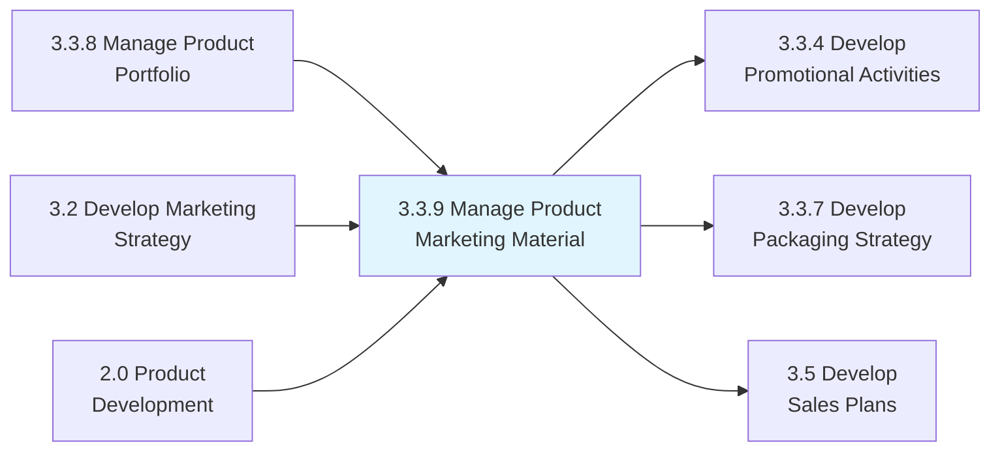

# Manage product marketing material

> Creating descriptions of products that are promotional and informative in content in order to initiate and increase sales.

## Overview

Process 3.3.9 - Manage Product Marketing Material is a specialized process within the marketing plan execution group that focuses on the creation, maintenance, and distribution of product-related marketing content. This process ensures that all product communications are accurate, compelling, and consistent across channels.

Product marketing materials serve as the bridge between product capabilities and customer needs. They translate technical features into customer benefits, differentiate offerings from competitors, and provide sales teams with the tools they need to effectively communicate value propositions. In today's omnichannel environment, these materials must work seamlessly across digital and physical touchpoints.

Effective management of product marketing materials requires coordination between product management, marketing, sales, and creative teams. The process encompasses both visual elements (images, videos, graphics) and written content (copy, descriptions, specifications), ensuring brand consistency and regulatory compliance across all touchpoints.

## Process Hierarchy



## Key Statistics

| Metric | Value |
|--------|-------|
| APQC Code | 16629 |
| Hierarchy ID | 3.3.9 |
| Level | Process |
| Parent | [3.3 Develop and Manage Marketing Plans](../) |
| Child Activities | 2 |
| Update Frequency | Per product change, quarterly review |
| Asset Types | Images, Copy, Video, Specifications |

## GraphDL Semantic Structure

```graphdl
manage.ProductMarketingMaterial
```

| Component | Value | Description |
|-----------|-------|-------------|
| Verb | `manage` | Overseeing creation and maintenance |
| Object | `ProductMarketingMaterial` | Marketing content for products |
| Preposition | - | Not applicable |
| PrepObject | - | Not applicable |

## Process Flow



## Sub-Processes

### [3.3.9.1 Manage product images](./ManageProductImages/)

Producing or overseeing the creation or acquisition of photos, images and graphics for a product description, advertisement, or other marketing asset. This includes photography, illustration, video, and digital assets.

**Key Activities:**
- Define image requirements and specifications
- Coordinate photography and production
- Review and approve visual assets
- Maintain digital asset management system
- Distribute images to appropriate channels
- Ensure brand and legal compliance
- Update imagery for product changes

**APQC Code:** 16630 | **Asset Types:** Photography, Illustrations, Video, 3D Models

### [3.3.9.2 Manage product copy](./ManageProductCopy/)

Authoring or overseeing the creation of the textual portion of a product description, advertisement, or other marketing document. This includes short-form and long-form content across all channels.

**Key Activities:**
- Develop messaging framework and key messages
- Create product descriptions and specifications
- Write feature and benefit content
- Develop SEO-optimized content
- Review and approve copy
- Manage localization and translation
- Publish and distribute content

**APQC Code:** 16631 | **Content Types:** Descriptions, Specifications, Ads, Web Content

## Material Types and Channels

| Material Type | Description | Primary Channels |
|---------------|-------------|------------------|
| Product Photography | High-quality product images | E-commerce, Catalogs, Advertising |
| Lifestyle Images | Products in context/use | Social Media, Advertising, Web |
| Video Content | Product demonstrations, features | Web, Social, Sales Presentations |
| Product Descriptions | Short-form product overview | E-commerce, Catalogs, POS |
| Technical Specifications | Detailed product attributes | Web, B2B Sales, Documentation |
| Sales Collateral | Brochures, sell sheets | Sales Team, Trade Shows |
| Advertising Copy | Campaign-specific messaging | Advertising, Promotions |
| Packaging Content | On-pack messaging and imagery | Physical Product, Retail |

## RACI Matrix

| Activity | Responsible | Accountable | Consulted | Informed |
|----------|-------------|-------------|-----------|----------|
| Define material requirements | Product Marketing | CMO | Product Mgmt, Sales | Creative |
| Coordinate image production | Creative Team | Creative Director | Product Marketing | Brand |
| Develop product copy | Copywriters | Content Director | Product Mgmt | Legal |
| Review and approve materials | Brand Manager | CMO | Legal, Regulatory | Sales |
| Manage digital asset library | Marketing Ops | VP Marketing | IT | All |
| Distribute to channels | Channel Marketing | VP Channel | E-commerce, Retail | Sales |
| Maintain material accuracy | Product Marketing | Brand Manager | Product Mgmt | All |
| Ensure compliance | Legal/Regulatory | General Counsel | Marketing | Leadership |

## Metrics & KPIs

| Metric | Description | Target | Frequency |
|--------|-------------|--------|-----------|
| Material Completeness | Products with full material sets | 100% | Monthly |
| Time to Market | Days from product launch to materials ready | <30 days | Per launch |
| Asset Utilization | Materials actively used vs. created | >80% | Quarterly |
| Content Accuracy | Materials without errors or updates needed | >99% | Continuous |
| Channel Coverage | Channels with current materials | 100% | Weekly |
| Brand Compliance | Materials meeting brand standards | 100% | Per review |
| Localization Coverage | Markets with localized materials | Target markets | Monthly |
| Sales Satisfaction | Sales team rating of material quality | >4/5 | Quarterly |

## Related Departments

| Department | Role in Material Management |
|------------|----------------------------|
| Product Marketing | Strategy, messaging, coordination |
| Creative Services | Image production, design |
| Content Team | Copywriting, content creation |
| Brand Management | Standards, approval, consistency |
| Marketing Operations | Systems, distribution, measurement |
| Legal/Regulatory | Compliance review, claims approval |
| Sales Enablement | Sales material creation, training |
| E-commerce | Digital material requirements |

## Related Occupations

- [Marketing Managers](/occupations/Management/MarketingManagers) - Overall material strategy
- [Product Marketing Managers](/occupations/Business/MarketingSpecialists) - Product positioning and messaging
- [Copywriters](/occupations/Arts/Writers) - Content creation
- [Photographers](/occupations/Arts/PhotographersCommercial) - Product photography
- [Graphic Designers](/occupations/Arts/GraphicDesigners) - Visual asset creation
- [Digital Asset Managers](/occupations/Business/MarketingSpecialists) - Asset organization and distribution
- [Content Strategists](/occupations/Business/MarketingSpecialists) - Content planning and optimization

## Industry Variations

### Consumer Products
High volume of SKUs requiring efficient asset production. Retailer-specific requirements for images and content. Packaging compliance and claims management critical. Seasonal updates and promotional variations.

**Industry-Specific Focus:**
- Retailer content syndication (Salsify, Syndigo)
- Packaging photography and mock-ups
- Promotional and seasonal variants
- Claims and regulatory compliance

### Technology/Electronics
Detailed technical specifications required. Comparison charts and competitive positioning. Software screenshots and interface images. Quick obsolescence requires agile updates.

**Industry-Specific Focus:**
- Technical specification sheets
- Compatibility and integration content
- Software/UI screenshots
- Quick update cycles for new versions

### Fashion/Apparel
Visual-centric with extensive photography needs. Model and lifestyle imagery essential. Size and fit content critical. Seasonal collections with tight timelines.

**Industry-Specific Focus:**
- Model and on-figure photography
- Color accuracy and fabric details
- Size and fit guides
- Seasonal catalog production

### Healthcare/Pharmaceutical
Heavily regulated content with compliance requirements. Medical claims require substantiation. Patient and HCP materials differ. Multi-language requirements common.

**Industry-Specific Focus:**
- FDA/regulatory compliance
- Clinical claims substantiation
- Professional vs. patient content
- Adverse event reporting requirements

### B2B/Industrial
Technical depth and specifications critical. Application-specific content for different industries. ROI and business case content. Sales enablement focus.

**Industry-Specific Focus:**
- Technical data sheets
- Application case studies
- ROI calculators and tools
- Industry-specific messaging

## Digital Asset Management

### Asset Organization
- Hierarchical folder structure by product/brand
- Consistent naming conventions
- Comprehensive metadata tagging
- Version control and history
- Usage rights and expiration tracking

### Distribution Workflow
- Channel-specific format requirements
- Automated resizing and formatting
- API integration with channels
- Rights management and watermarking
- Analytics on asset usage

### Governance
- Clear approval workflows
- Brand compliance checks
- Legal and regulatory review
- Archive and sunset policies
- Audit trails

## Best Practices

### Content Excellence
- Lead with benefits, support with features
- Use customer language, not internal jargon
- Optimize for search (SEO)
- Test content performance
- Maintain consistency across channels

### Visual Standards
- Invest in quality photography
- Establish consistent styling
- Plan for multiple use cases
- Include lifestyle and context shots
- Optimize for digital performance

### Process Efficiency
- Centralize asset management
- Automate distribution where possible
- Establish clear approval workflows
- Plan for localization from start
- Measure and optimize continuously

## Related Processes



## Technology Enablers

| Technology | Purpose | Examples |
|------------|---------|----------|
| Digital Asset Management (DAM) | Asset storage and distribution | Adobe Experience Manager, Bynder, Widen |
| Product Information Management (PIM) | Product data centralization | Salsify, Akeneo, inRiver |
| Content Management System (CMS) | Web content publishing | Adobe Experience Manager, Contentful |
| Creative Tools | Asset creation | Adobe Creative Cloud, Figma |
| Translation Management | Localization workflow | Smartling, Lionbridge |
| Brand Management | Brand compliance | Frontify, Bynder |

## Related Concepts

- Product Marketing Material
- Digital Asset Management
- Content Marketing
- Brand Consistency
- Sales Enablement
- Product Photography
- Copywriting

---

*Source: APQC PCF 16629 (3.3.9) - Cross-Industry*
