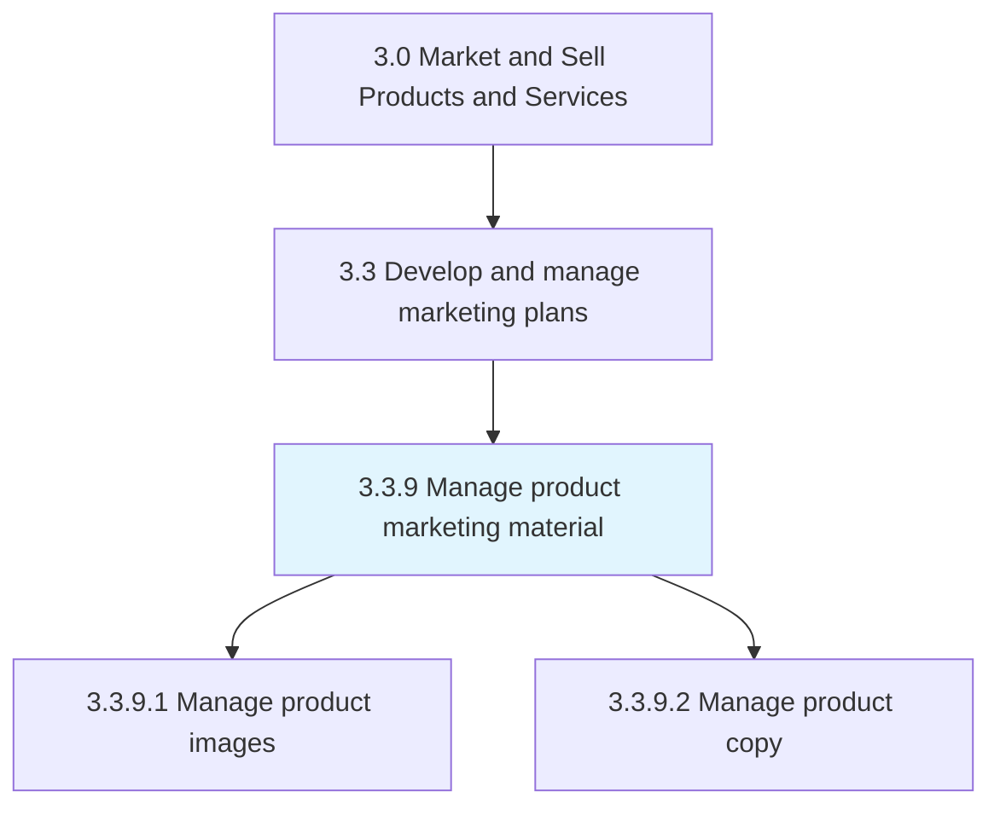
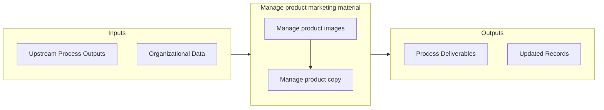

# Manage product marketing material

> Creating descriptions of products that are promotional and informative in content in order to initiate and increase sales.

## Overview

Process 3.3.9 is a core process that defines the specific procedures for manage product marketing material. 

Creating descriptions of products that are promotional and informative in content in order to initiate and increase sales. Marketing content consists of text, and optionally, images.

## Process Hierarchy



## Key Statistics

| Metric | Value |
|--------|-------|
| APQC Code | 16629 |
| Hierarchy ID | 3.3.9 |
| Level | Process |
| Parent | [3.3](../) |
| Sub-Processes | 2 |


## GraphDL Semantic Structure

```
manage.ProductMarketingMaterial
```

| Component | Value | Description |
|-----------|-------|-------------|
| Verb | `manage` | Primary action |
| Object | `product marketing material` | Direct object |


## Process Flow



## Sub-Processes

| Process | Hierarchy ID | Description |
|---------|-------------|-------------|
| [Manage product images](./ManageProductImages) | 3.3.9.1 | Producing or overseeing the creation or acquisition of photos, images and graphics for a product des |
| [Manage product copy](./ManageProductCopy) | 3.3.9.2 | Authoring or overseeing the creation of the textual portion of a product description, advertisement, |


## Related Concepts

- [ProductMarketingMaterial](/concepts/ProductMarketingMaterial)


---

*Source: APQC PCF 16629 (3.3.9) - APQC*
