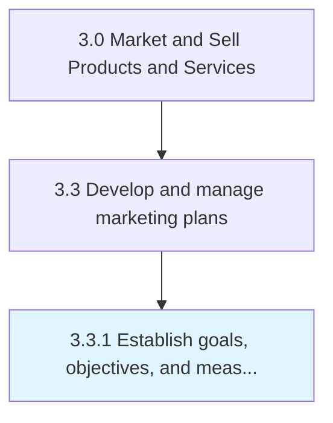

# Establish goals, objectives, and measures for products/services by channel/segment

> Determining what to achieve by marketing.

## Overview

Process 3.3.1 is a core process that defines the specific procedures for establish goals, objectives, and measures for products/services by channel/segment. 

Determining what to achieve by marketing. Create qualitative and quantitative targets. Establish metrics to track performance (for individual Market segments [10109] and Channels for target segments [10129]). Enlist the head of marketing to determine marketing priorities and the related measures. (The decision in establishing these goals, objectives, and metrics is founded in Develop marketing strategy [10102] and takes cues from current priorities and organizational strategy.)

## Process Hierarchy



## Key Statistics

| Metric | Value |
|--------|-------|
| APQC Code | 10148 |
| Hierarchy ID | 3.3.1 |
| Level | Process |
| Parent | [3.3](../) |
| Sub-Processes | 0 |


## Process Overview

Sales and marketing processes understand markets, develop marketing strategies, and manage sales activities. This process focuses on establish goals, objectives, and measures for products/services by channel/segment, which is essential for organizational effectiveness and achieving business objectives.

## Key Metrics

| Metric | Description | Target |
|--------|-------------|--------|
| Revenue growth | Measure of revenue growth | Target varies by organization |
| Customer acquisition cost | Measure of customer acquisition cost | Target varies by organization |
| Sales conversion rate | Measure of sales conversion rate | Target varies by organization |
| Marketing ROI | Measure of marketing roi | Target varies by organization |

## Related Departments

- [Sales](/departments/Sales)
- [Marketing](/departments/Marketing)
- [Analytics](/departments/Analytics)

## Related Occupations

- [Sales Managers](/occupations/Management/SalesManagers)
- [Marketing Managers](/occupations/Management/MarketingManagers)
- [Market Research Analysts](/occupations/Business/MarketResearchAnalysts)

## RACI Matrix

| Activity | Responsible | Accountable | Consulted | Informed |
|----------|-------------|-------------|-----------|----------|
| Plan | Process Owner | Manager | Stakeholders | Team |
| Execute | Team | Process Owner | Manager | Stakeholders |
| Monitor | Analyst | Manager | Process Owner | Leadership |
| Improve | Process Owner | Manager | Team | Stakeholders |

## GraphDL Semantic Structure

```graphdl
establish.GoalsObjectivesAndMeasures.for.ProductsservicesByChannelsegment
```

| Component | Value | Description |
|-----------|-------|-------------|
| Verb | `establish` | Primary action |
| Object | `goals, objectives, and measures` | Direct object |
| Preposition | `for` | Relationship |
| PrepObject | `products/services by channel/segment` | Indirect object |


## Related Concepts

- Goals
- Products
- Goals
- ServicesByChannel
- Goals
- Segment
- Objectives
- Products
- Objectives
- ServicesByChannel


---

*Source: APQC PCF 10148 (3.3.1) - APQC*
