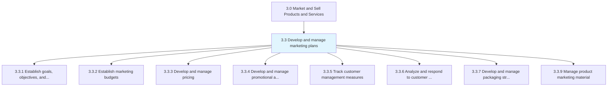
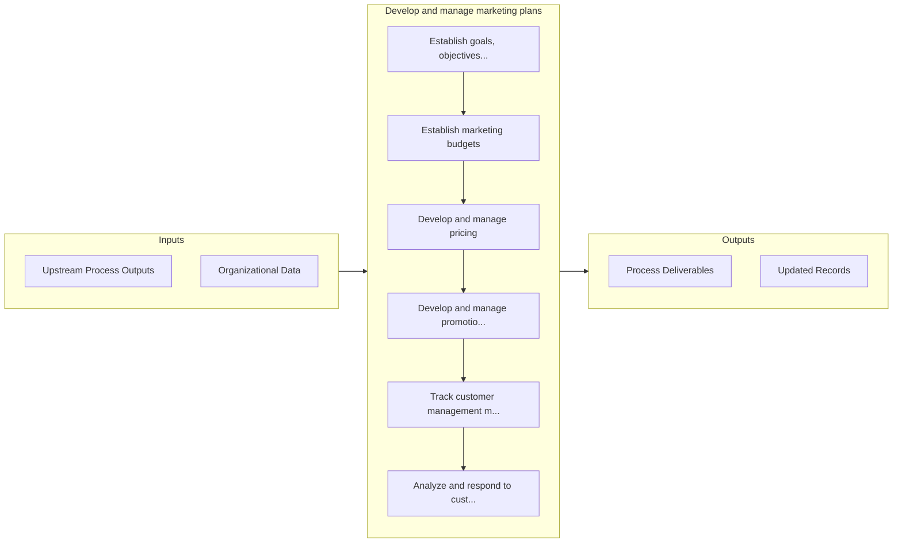

# Develop and manage marketing plans

> Creating specific plans to market offerings to customers.

## Overview

Group 3.3 is a process group within APQC Category 3.0 (Market and Sell Products and Services). 

Creating specific plans to market offerings to customers. This process group includes processes for making budgets, identifying and developing media, pricing products and services, managing packaging, managing marketing content and promotional activities, tracking and responding to customer insight and monitoring measures established within "develop marketing strategy". Additionally, in this process group, organizations take action on plans made in earlier processes. Here, marketing and customers are managed and measured along with any supporting materials.

## Process Hierarchy



## Key Statistics

| Metric | Value |
|--------|-------|
| APQC Code | 20008 |
| Hierarchy ID | 3.3 |
| Level | Group |
| Parent | [3](../) |
| Sub-Processes | 8 |


## GraphDL Semantic Structure

```graphdl
develop.AndManageMarketingPlans
```

| Component | Value | Description |
|-----------|-------|-------------|
| Verb | `develop` | Primary action |
| Object | `and manage marketing plans` | Direct object |


## Process Flow



## Sub-Processes

| Process | Hierarchy ID | Description |
|---------|-------------|-------------|
| [Establish goals, objectives, and measures for products/services by channel/segment](./EstablishGoalsObjectivesAndMeasuresForProductsservicesByChannelsegment) | 3.3.1 | Determining what to achieve by marketing |
| [Establish marketing budgets](./3.3.2-EstablishMarketingBudgets/) | 3.3.2 | Creating a budget for the organization's marketing efforts, in line with the business-wide strategic |
| [Develop and manage pricing](./3.3.3-DevelopManagePricing/) | 3.3.3 | Determining and maintaining a pricing mechanism based on forecasted sales and that enables a pricing |
| [Develop and manage promotional activities](./3.3.4-DevelopManagePromotionalActivities/) | 3.3.4 | Conceptualizing, testing, and executing product/service/brand promotions |
| [Track customer management measures](./3.3.5-TrackCustomerManagementMeasures/) | 3.3.5 | Collating all customer-centered metrics |
| [Analyze and respond to customer insight](./3.3.6-AnalyzeRespondCustomerInsight/) | 3.3.6 | Reviewing and responding to customer feedback |
| [Develop and manage packaging strategy](./3.3.7-DevelopManagePackagingStrategy/) | 3.3.7 | Creating, executing, and administering a strategic road map for packaging products/services |
| [Manage product marketing material](./3.3.9-ManageProductMarketingMaterial/) | 3.3.9 | Creating descriptions of products that are promotional and informative in content in order to initia |


## Related Concepts

- MarketingPlans
- MarketingPlans


---

*Source: APQC PCF 20008 (3.3) - APQC*
