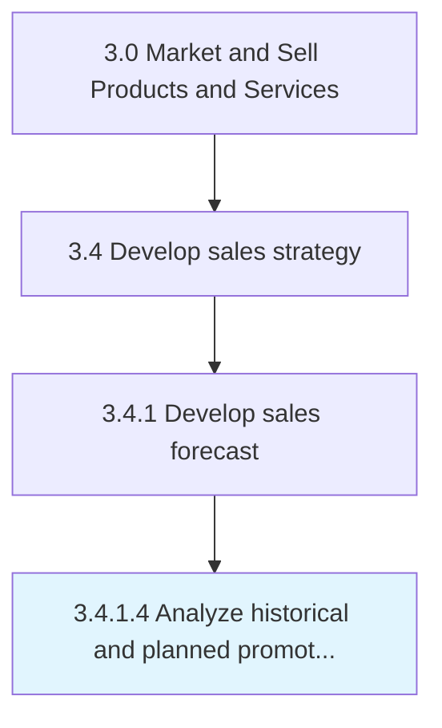

# Analyze historical and planned promotions and events

> Reviewing promotional activities' effect on the sales orders.

## Overview

Activity 3.4.1.4 is an activity within the Market and Sell Products and Services framework. 

Reviewing promotional activities' effect on the sales orders. Analyze all promotional events and campaigns that the organization has already employed or is planning to deploy.

## Process Hierarchy



## Key Statistics

| Metric | Value |
|--------|-------|
| APQC Code | 10137 |
| Hierarchy ID | 3.4.1.4 |
| Level | Activity |
| Parent | [3.4.1](../) |
| Sub-Processes | 0 |


## GraphDL Semantic Structure

```
analyze.HistoricalAndPlannedPromotionsAndEvents
```

| Component | Value | Description |
|-----------|-------|-------------|
| Verb | `analyze` | Primary action |
| Object | `historical and planned promotions and events` | Direct object |


## Related Concepts

- [Historical](/concepts/Historical)
- [PlannedPromotions](/concepts/PlannedPromotions)
- [Events](/concepts/Events)


---

*Source: APQC PCF 10137 (3.4.1.4) - APQC*
