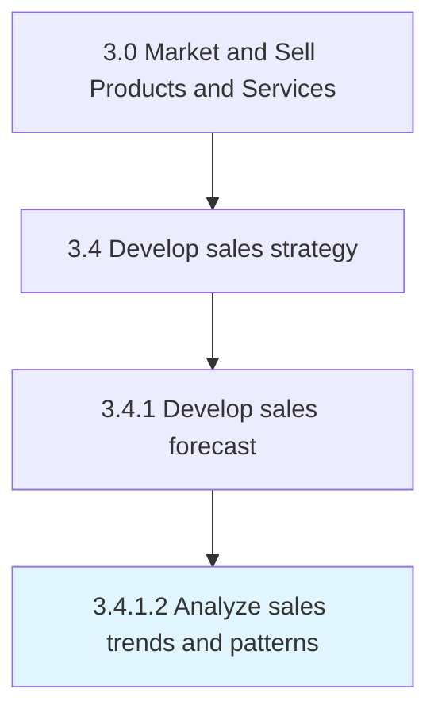

# Analyze sales trends and patterns

> Analyzing sales order data to identify patterns in order to capitalize on emerging trends in the industry or the economy.

## Overview

Activity 3.4.1.2 is an activity within the Market and Sell Products and Services framework. 

Analyzing sales order data to identify patterns in order to capitalize on emerging trends in the industry or the economy. Closely examine the directory of sales orders. Discern any patterns from this index, which is representative of the demand for the organization's offerings. Identify trends among the various segments of the organization's customer base to create forecasts. Glean patterns from this analysis, including the triangulation of segments that are showing the most growth in demand or those that represent the highest decline revenue, industry-wide trends such as decline/boost in overall demand, and any unusual trends that lie outside of the organization's expectations.

## Process Hierarchy



## Key Statistics

| Metric | Value |
|--------|-------|
| APQC Code | 10135 |
| Hierarchy ID | 3.4.1.2 |
| Level | Activity |
| Parent | [3.4.1](../) |
| Sub-Processes | 0 |


## GraphDL Semantic Structure

```
analyze.SalesTrendsAndPatterns
```

| Component | Value | Description |
|-----------|-------|-------------|
| Verb | `analyze` | Primary action |
| Object | `sales trends and patterns` | Direct object |


## Related Concepts

- SalesTrends
- Patterns


---

*Source: APQC PCF 10135 (3.4.1.2) - APQC*
