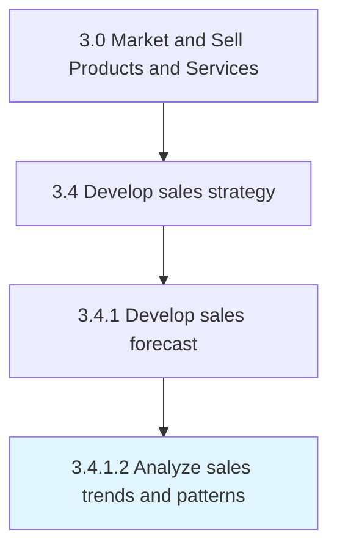

# Analyze sales trends and patterns

> Analyzing sales order data to identify patterns in order to capitalize on emerging trends in the industry or the economy.

## Overview

Activity 3.4.1.2 is an activity within the Market and Sell Products and Services framework.

Analyzing sales order data to identify patterns in order to capitalize on emerging trends in the industry or the economy. Closely examine the directory of sales orders. Discern any patterns from this index, which is representative of the demand for the organization's offerings. Identify trends among the various segments of the organization's customer base to create forecasts. Glean patterns from this analysis, including the triangulation of segments that are showing the most growth in demand or those that represent the highest decline revenue, industry-wide trends such as decline/boost in overall demand, and any unusual trends that lie outside of the organization's expectations.

This process is critical to effective sales and marketing execution. It ensures that activities are systematically planned, executed, and measured against organizational objectives. When performed effectively, this process drives revenue growth, enhances customer engagement, and strengthens competitive positioning in target markets.

## Process Hierarchy



## Key Statistics

| Metric | Value |
|--------|-------|
| APQC Code | 10135 |
| Hierarchy ID | 3.4.1.2 |
| Level | Activity |
| Parent | [3.4.1](../) |
| Sub-Processes | 0 |

## Process Flow


## GraphDL Semantic Structure

```
analyze.SalesTrendsAndPatterns
```

| Component | Value | Description |
|-----------|-------|-------------|
| Verb | `analyze` | Primary action |
| Object | `sales trends and patterns` | Direct object |


## RACI Matrix

| Role | Responsible | Accountable | Consulted | Informed |
|------|:-----------:|:-----------:|:---------:|:--------:|
| Sales Manager | R |  |  |  |
| VP Sales |  | A |  |  |
| Financial Analyst |  |  | C |  |
| Marketing Manager |  |  | C |  |
| Executive Leadership |  |  |  | I |

## Related Occupations

- [Sales Managers](/occupations/Management/SalesManagers)
- [Market Research Analysts](/occupations/Business-and-Financial-Operations/MarketResearchAnalysts)
- [Sales Representatives Wholesale And Manufacturing](/occupations/Sales-and-Related/SalesRepresentativesWholesaleAndManufacturing)
- [Financial Analysts](/occupations/Business-and-Financial-Operations/FinancialAnalysts)
- [Marketing Managers](/occupations/Management/MarketingManagers)

## Related Departments

- [Sales](/departments/Sales)
- [Finance](/departments/Finance)
- [Marketing](/departments/Marketing)

## Industry Variations

### Manufacturing

In manufacturing, analyze sales trends and patterns involves long sales cycles, technical selling approaches, distributor network management, and volume-based pricing models.

### Retail

In retail, analyze sales trends and patterns focuses on seasonal demand forecasting, store-level sales planning, and category management strategies.

### Technology

In technology, analyze sales trends and patterns emphasizes subscription-based revenue models, partner ecosystem development, and solution selling methodologies.

## KPIs & Metrics

| Metric | Description | Target |
|--------|-------------|--------|
| Sales Forecast Accuracy | Variance between forecasted and actual sales | <10% variance |
| Pipeline Coverage Ratio | Ratio of pipeline value to sales target | >3:1 |
| Partner Revenue Contribution | Percentage of revenue generated through partners | >25% |
| Sales Budget Efficiency | Revenue generated per dollar of sales budget | >5:1 |

## Related Concepts

- SalesTrends
- Patterns

---

*Source: APQC PCF 10135 (3.4.1.2) - APQC*
