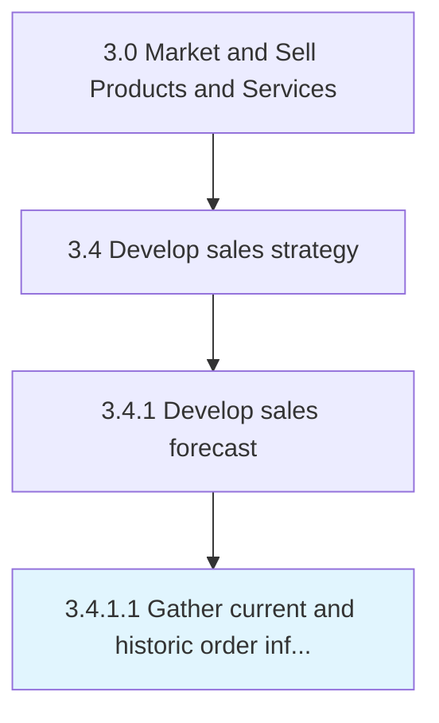

# Gather current and historic order information

> Gathering all information about sales orders into an index.

## Overview

Activity 3.4.1.1 is an activity within the Market and Sell Products and Services framework.

Gathering all information about sales orders into an index. Create a directory of all sales orders, whether open or those which have been fulfilled. Track what product/service was ordered, the quantity ordered, who ordered it, the delivery date, the shipping method, the unit price and line total, payment terms, and any discount applied.

This process is critical to effective sales and marketing execution. It ensures that activities are systematically planned, executed, and measured against organizational objectives. When performed effectively, this process drives revenue growth, enhances customer engagement, and strengthens competitive positioning in target markets.

## Process Hierarchy



## Key Statistics

| Metric | Value |
|--------|-------|
| APQC Code | 10134 |
| Hierarchy ID | 3.4.1.1 |
| Level | Activity |
| Parent | [3.4.1](../) |
| Sub-Processes | 0 |

## Process Flow


## GraphDL Semantic Structure

```graphdl
gather.CurrentAndHistoricOrderInformation
```

| Component | Value | Description |
|-----------|-------|-------------|
| Verb | `gather` | Primary action |
| Object | `current and historic order information` | Direct object |


## RACI Matrix

| Role | Responsible | Accountable | Consulted | Informed |
|------|:-----------:|:-----------:|:---------:|:--------:|
| Sales Manager | R |  |  |  |
| VP Sales |  | A |  |  |
| Financial Analyst |  |  | C |  |
| Marketing Manager |  |  | C |  |
| Executive Leadership |  |  |  | I |

## Related Occupations

- [Sales Managers](/occupations/Management/SalesManagers)
- [Market Research Analysts](/occupations/Business-and-Financial-Operations/MarketResearchAnalysts)
- [Sales Representatives Wholesale And Manufacturing](/occupations/Sales-and-Related/SalesRepresentativesWholesaleAndManufacturing)
- [Financial Analysts](/occupations/Business-and-Financial-Operations/FinancialAnalysts)
- [Marketing Managers](/occupations/Management/MarketingManagers)

## Related Departments

- [Sales](/departments/Sales)
- [Finance](/departments/Finance)
- [Marketing](/departments/Marketing)

## Industry Variations

### Manufacturing

In manufacturing, gather current and historic order information involves long sales cycles, technical selling approaches, distributor network management, and volume-based pricing models.

### Retail

In retail, gather current and historic order information focuses on seasonal demand forecasting, store-level sales planning, and category management strategies.

### Technology

In technology, gather current and historic order information emphasizes subscription-based revenue models, partner ecosystem development, and solution selling methodologies.

## KPIs & Metrics

| Metric | Description | Target |
|--------|-------------|--------|
| Sales Forecast Accuracy | Variance between forecasted and actual sales | <10% variance |
| Pipeline Coverage Ratio | Ratio of pipeline value to sales target | >3:1 |
| Partner Revenue Contribution | Percentage of revenue generated through partners | >25% |
| Sales Budget Efficiency | Revenue generated per dollar of sales budget | >5:1 |

## Related Concepts

- CurrentOrderInformation
- HistoricOrderInformation

---

*Source: APQC PCF 10134 (3.4.1.1) - APQC*
