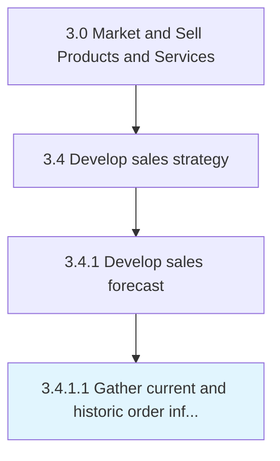

# Gather current and historic order information

> Gathering all information about sales orders into an index.

## Overview

Activity 3.4.1.1 is an activity within the Market and Sell Products and Services framework. 

Gathering all information about sales orders into an index. Create a directory of all sales orders, whether open or those which have been fulfilled. Track what product/service was ordered, the quantity ordered, who ordered it, the delivery date, the shipping method, the unit price and line total, payment terms, and any discount applied.

## Process Hierarchy



## Key Statistics

| Metric | Value |
|--------|-------|
| APQC Code | 10134 |
| Hierarchy ID | 3.4.1.1 |
| Level | Activity |
| Parent | [3.4.1](../) |
| Sub-Processes | 0 |


## GraphDL Semantic Structure

```
gather.CurrentAndHistoricOrderInformation
```

| Component | Value | Description |
|-----------|-------|-------------|
| Verb | `gather` | Primary action |
| Object | `current and historic order information` | Direct object |


## Related Concepts

- CurrentOrderInformation
- HistoricOrderInformation


---

*Source: APQC PCF 10134 (3.4.1.1) - APQC*
