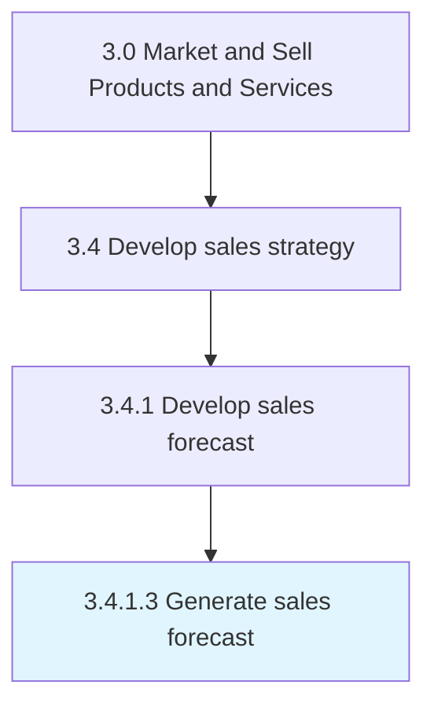

# Generate sales forecast

> Calculating the future demand for the organization's products/services.

## Overview

Activity 3.4.1.3 is an activity within the Market and Sell Products and Services framework. 

Calculating the future demand for the organization's products/services. Use the trends and patterns identified in the sales data to estimate future demand. Use forecast to prepare for future customer demand and to recalibrate the strategic course of functions and business units.

## Process Hierarchy



## Key Statistics

| Metric | Value |
|--------|-------|
| APQC Code | 10136 |
| Hierarchy ID | 3.4.1.3 |
| Level | Activity |
| Parent | [3.4.1](../) |
| Sub-Processes | 0 |


## GraphDL Semantic Structure

```
generate.SalesForecast
```

| Component | Value | Description |
|-----------|-------|-------------|
| Verb | `generate` | Primary action |
| Object | `sales forecast` | Direct object |


## Related Concepts

- SalesForecast


---

*Source: APQC PCF 10136 (3.4.1.3) - APQC*
