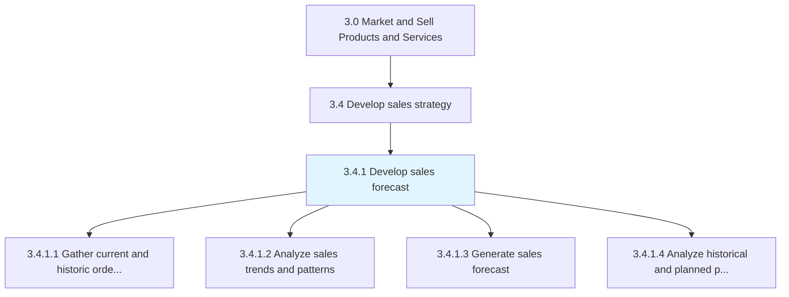
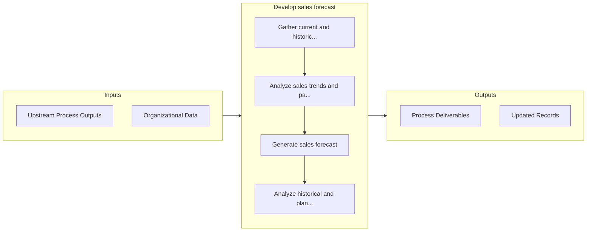

# Develop sales forecast

> Developing a sales forecast for the organization's portfolio of offerings, bearing in mind the effect of promotional events, and fine-tuning these in the context of the new forecast.

## Overview

Process 3.4.1 is a core process that defines the specific procedures for develop sales forecast. 

Developing a sales forecast for the organization's portfolio of offerings, bearing in mind the effect of promotional events, and fine-tuning these in the context of the new forecast. Estimate the future demand for the organization's products/services by analyzing historical information and any promotional activity.

## Process Hierarchy



## Key Statistics

| Metric | Value |
|--------|-------|
| APQC Code | 10129 |
| Hierarchy ID | 3.4.1 |
| Level | Process |
| Parent | [3.4](../) |
| Sub-Processes | 4 |


## GraphDL Semantic Structure

```
develop.SalesForecast
```

| Component | Value | Description |
|-----------|-------|-------------|
| Verb | `develop` | Primary action |
| Object | `sales forecast` | Direct object |


## Process Flow



## Sub-Processes

| Process | Hierarchy ID | Description |
|---------|-------------|-------------|
| [Gather current and historic order information](./GatherCurrentAndHistoricOrderInformation) | 3.4.1.1 | Gathering all information about sales orders into an index |
| [Analyze sales trends and patterns](./AnalyzeSalesTrendsAndPatterns) | 3.4.1.2 | Analyzing sales order data to identify patterns in order to capitalize on emerging trends in the ind |
| [Generate sales forecast](./GenerateSalesForecast) | 3.4.1.3 | Calculating the future demand for the organization's products/services |
| [Analyze historical and planned promotions and events](./AnalyzeHistoricalAndPlannedPromotionsAndEvents) | 3.4.1.4 | Reviewing promotional activities' effect on the sales orders |


## Related Concepts

- SalesForecast


---

*Source: APQC PCF 10129 (3.4.1) - APQC*
