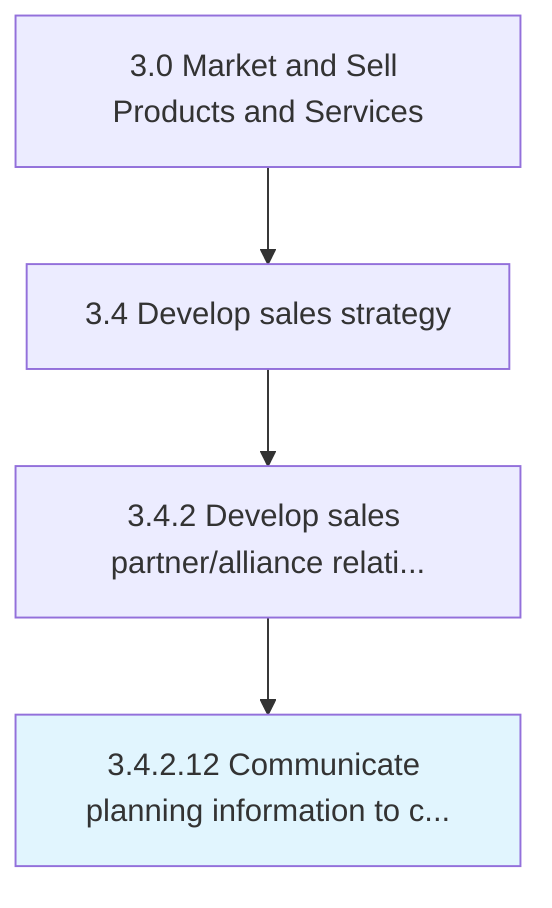

# Communicate planning information to customer teams

> Sending invitations and distributing information about upcoming events to customer teams and other involved entities.

## Overview

Activity 3.4.2.12 is an activity within the Market and Sell Products and Services framework. 

Sending invitations and distributing information about upcoming events to customer teams and other involved entities.

## Process Hierarchy



## Key Statistics

| Metric | Value |
|--------|-------|
| APQC Code | 11468 |
| Hierarchy ID | 3.4.2.12 |
| Level | Activity |
| Parent | [3.4.2](../) |
| Sub-Processes | 0 |


## GraphDL Semantic Structure

```
communicate.PlanningInformation.to.CustomerTeams
```

| Component | Value | Description |
|-----------|-------|-------------|
| Verb | `communicate` | Primary action |
| Object | `planning information` | Direct object |
| Preposition | `to` | Relationship |
| PrepObject | `customer teams` | Indirect object |


## Related Concepts

- PlanningInformation
- CustomerTeams


---

*Source: APQC PCF 11468 (3.4.2.12) - APQC*
