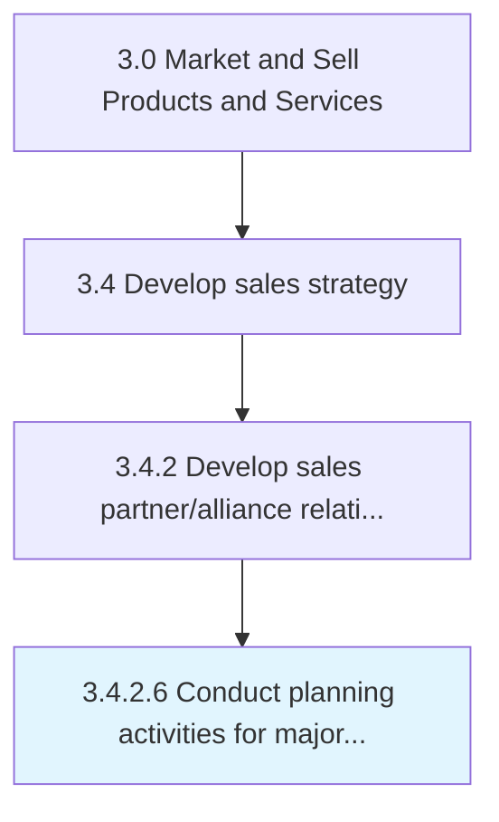

# Conduct planning activities for major trade customers

> Arranging meetings with trade partners to coordinate logistics, manage critical resources, resolve bottlenecks, and schedule urgent or time-sensitive matters.

## Overview

Activity 3.4.2.6 is an activity within the Market and Sell Products and Services framework. 

Arranging meetings with trade partners to coordinate logistics, manage critical resources, resolve bottlenecks, and schedule urgent or time-sensitive matters.

## Process Hierarchy



## Key Statistics

| Metric | Value |
|--------|-------|
| APQC Code | 11466 |
| Hierarchy ID | 3.4.2.6 |
| Level | Activity |
| Parent | [3.4.2](../) |
| Sub-Processes | 0 |


## GraphDL Semantic Structure

```
conduct.PlanningActivities.for.MajorTradeCustomers
```

| Component | Value | Description |
|-----------|-------|-------------|
| Verb | `conduct` | Primary action |
| Object | `planning activities` | Direct object |
| Preposition | `for` | Relationship |
| PrepObject | `major trade customers` | Indirect object |


## Related Concepts

- PlanningActivities
- MajorTradeCustomers


---

*Source: APQC PCF 11466 (3.4.2.6) - APQC*
