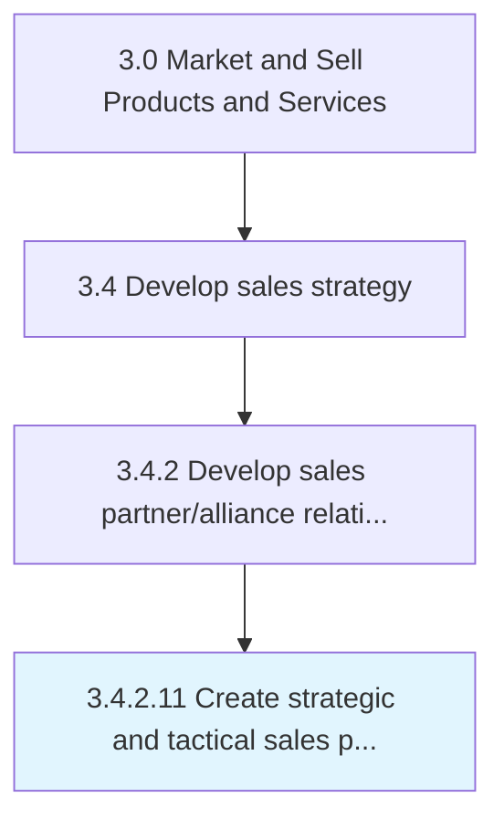

# Create strategic and tactical sales plans by customer

> Establishing long term customer sales plans to assess current sales and to determine future sales objectives, strategies for achieving the goals, and available resources.

## Overview

Activity 3.4.2.11 is an activity within the Market and Sell Products and Services framework. 

Establishing long term customer sales plans to assess current sales and to determine future sales objectives, strategies for achieving the goals, and available resources.

## Process Hierarchy



## Key Statistics

| Metric | Value |
|--------|-------|
| APQC Code | 11523 |
| Hierarchy ID | 3.4.2.11 |
| Level | Activity |
| Parent | [3.4.2](../) |
| Sub-Processes | 0 |


## GraphDL Semantic Structure

```
create.StrategicAndTacticalSalesPlans.by.Customer
```

| Component | Value | Description |
|-----------|-------|-------------|
| Verb | `create` | Primary action |
| Object | `strategic and tactical sales plans` | Direct object |
| Preposition | `by` | Relationship |
| PrepObject | `customer` | Indirect object |


## Related Concepts

- StrategicSalesPlans
- Customer
- TacticalSalesPlans
- Customer


---

*Source: APQC PCF 11523 (3.4.2.11) - APQC*
