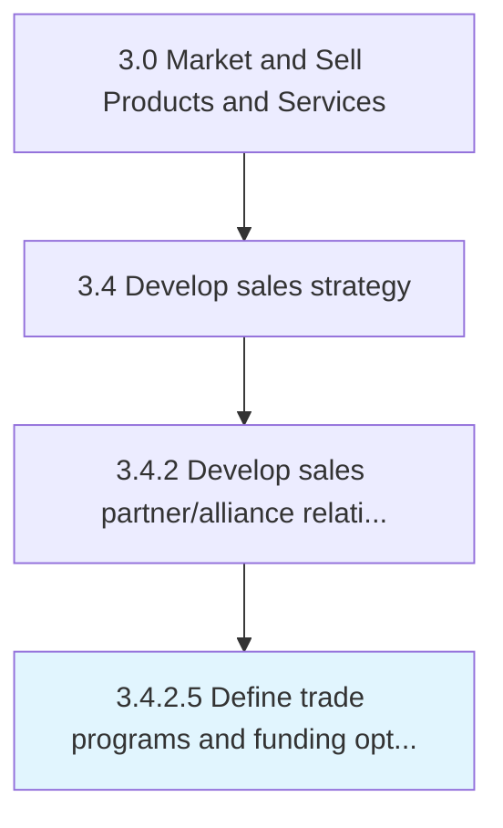

# Define trade programs and funding options

> Establishing business-to-business marketing campaigns and financial incentives for wholesalers, dealers, distributors and other intermediaries that the company uses to distribute its products or services.

## Overview

Activity 3.4.2.5 is an activity within the Market and Sell Products and Services framework. 

Establishing business-to-business marketing campaigns and financial incentives for wholesalers, dealers, distributors and other intermediaries that the company uses to distribute its products or services.

## Process Hierarchy



## Key Statistics

| Metric | Value |
|--------|-------|
| APQC Code | 11521 |
| Hierarchy ID | 3.4.2.5 |
| Level | Activity |
| Parent | [3.4.2](../) |
| Sub-Processes | 0 |


## GraphDL Semantic Structure

```
define.TradeProgramsAndFundingOptions
```

| Component | Value | Description |
|-----------|-------|-------------|
| Verb | `define` | Primary action |
| Object | `trade programs and funding options` | Direct object |


## Related Concepts

- [TradePrograms](/concepts/TradePrograms)
- [FundingOptions](/concepts/FundingOptions)


---

*Source: APQC PCF 11521 (3.4.2.5) - APQC*
