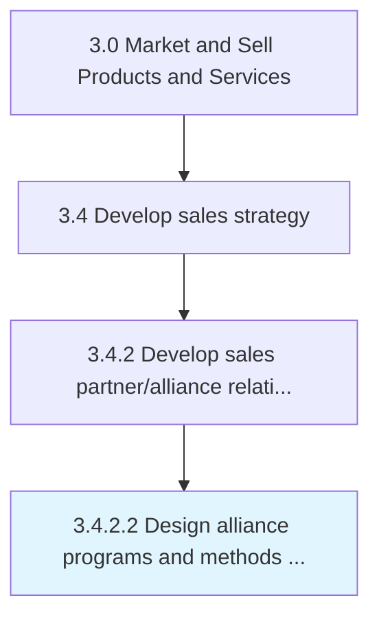

# Design alliance programs and methods for selecting and managing relationships

> Creating the frameworks needed to select alliance partners, and maintaining relationships with them.

## Overview

Activity 3.4.2.2 is an activity within the Market and Sell Products and Services framework. 

Creating the frameworks needed to select alliance partners, and maintaining relationships with them. Create a framework for structured programs that can receive and support multiple alliances. Clearly outline the responsibilities and benefits of the alliance partners. Create frameworks for selecting the right alliance partners, and maintain a relationship with them. Create or repurpose teams of relationship managers and outline a methodology for selecting alliance partners.

## Process Hierarchy



## Key Statistics

| Metric | Value |
|--------|-------|
| APQC Code | 10139 |
| Hierarchy ID | 3.4.2.2 |
| Level | Activity |
| Parent | [3.4.2](../) |
| Sub-Processes | 0 |


## Process Overview

Sales and marketing processes understand markets, develop marketing strategies, and manage sales activities. This process focuses on design alliance programs and methods for selecting and managing relationships, which is essential for organizational effectiveness and achieving business objectives.

## Key Metrics

| Metric | Description | Target |
|--------|-------------|--------|
| Revenue growth | Measure of revenue growth | Target varies by organization |
| Customer acquisition cost | Measure of customer acquisition cost | Target varies by organization |
| Sales conversion rate | Measure of sales conversion rate | Target varies by organization |
| Marketing ROI | Measure of marketing roi | Target varies by organization |

## Related Departments

- [Sales](/departments/Sales)
- [Marketing](/departments/Marketing)
- [Analytics](/departments/Analytics)

## Related Occupations

- [Sales Managers](/occupations/Management/SalesManagers)
- [Marketing Managers](/occupations/Management/MarketingManagers)
- [Market Research Analysts](/occupations/Business/MarketResearchAnalysts)

## RACI Matrix

| Activity | Responsible | Accountable | Consulted | Informed |
|----------|-------------|-------------|-----------|----------|
| Plan | Process Owner | Manager | Stakeholders | Team |
| Execute | Team | Process Owner | Manager | Stakeholders |
| Monitor | Analyst | Manager | Process Owner | Leadership |
| Improve | Process Owner | Manager | Team | Stakeholders |

## GraphDL Semantic Structure

```graphdl
design.AllianceProgramsAndMethods.for.SelectingAndManagingRelationships
```

| Component | Value | Description |
|-----------|-------|-------------|
| Verb | `design` | Primary action |
| Object | `alliance programs and methods` | Direct object |
| Preposition | `for` | Relationship |
| PrepObject | `selecting and managing relationships` | Indirect object |


## Related Concepts

- AlliancePrograms
- SelectingRelationships
- AlliancePrograms
- ManagingRelationships
- Methods
- SelectingRelationships
- Methods
- ManagingRelationships


---

*Source: APQC PCF 10139 (3.4.2.2) - APQC*
