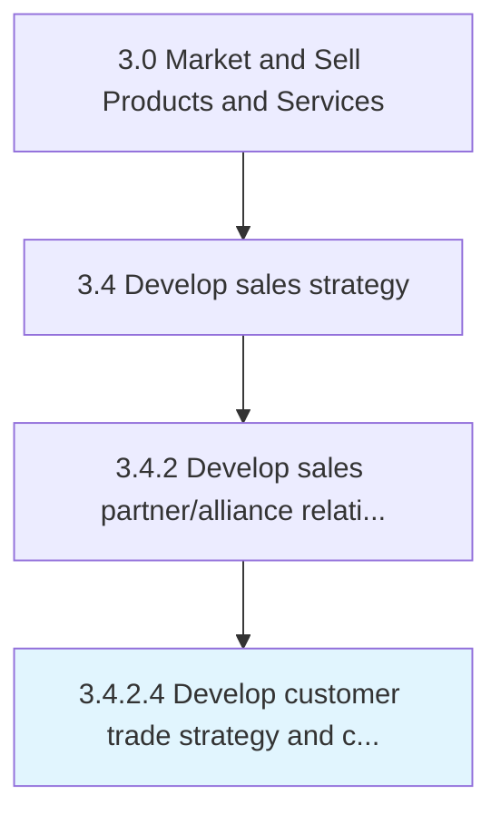
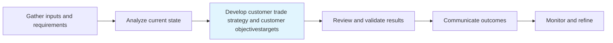

# Develop customer trade strategy and customer objectives/targets

> Implementing category management strategies for customers through the use of consumer insights and understanding of customer specifics.

## Overview

Activity 3.4.2.4 is an activity within the Market and Sell Products and Services framework.

Implementing category management strategies for customers through the use of consumer insights and understanding of customer specifics. Develop consumer and channel insights. Establish long term strategies, objectives and targets across the brand.

This process is critical to effective sales and marketing execution. It ensures that activities are systematically planned, executed, and measured against organizational objectives. When performed effectively, this process drives revenue growth, enhances customer engagement, and strengthens competitive positioning in target markets.

## Process Hierarchy



## Key Statistics

| Metric | Value |
|--------|-------|
| APQC Code | 11465 |
| Hierarchy ID | 3.4.2.4 |
| Level | Activity |
| Parent | [3.4.2](../) |
| Sub-Processes | 0 |

## Process Flow



## GraphDL Semantic Structure

```graphdl
develop.CustomerTradeStrategyAndCustomerObjectivestargets
```

| Component | Value | Description |
|-----------|-------|-------------|
| Verb | `develop` | Primary action |
| Object | `customer trade strategy and customer objectives/targets` | Direct object |


## RACI Matrix

| Role | Responsible | Accountable | Consulted | Informed |
|------|:-----------:|:-----------:|:---------:|:--------:|
| Sales Manager | R |  |  |  |
| VP Sales |  | A |  |  |
| Financial Analyst |  |  | C |  |
| Marketing Manager |  |  | C |  |
| Executive Leadership |  |  |  | I |

## Related Occupations

- [Sales Managers](/occupations/Management/SalesManagers)
- [Market Research Analysts](/occupations/Business-and-Financial-Operations/MarketResearchAnalysts)
- [Sales Representatives Wholesale And Manufacturing](/occupations/Sales-and-Related/SalesRepresentativesWholesaleAndManufacturing)
- [Financial Analysts](/occupations/Business-and-Financial-Operations/FinancialAnalysts)
- [Marketing Managers](/occupations/Management/MarketingManagers)

## Related Departments

- [Sales](/departments/Sales)
- [Finance](/departments/Finance)
- [Marketing](/departments/Marketing)

## Industry Variations

### Manufacturing

In manufacturing, develop customer trade strategy and customer objectives/targets involves long sales cycles, technical selling approaches, distributor network management, and volume-based pricing models.

### Retail

In retail, develop customer trade strategy and customer objectives/targets focuses on seasonal demand forecasting, store-level sales planning, and category management strategies.

### Technology

In technology, develop customer trade strategy and customer objectives/targets emphasizes subscription-based revenue models, partner ecosystem development, and solution selling methodologies.

## KPIs & Metrics

| Metric | Description | Target |
|--------|-------------|--------|
| Sales Forecast Accuracy | Variance between forecasted and actual sales | <10% variance |
| Pipeline Coverage Ratio | Ratio of pipeline value to sales target | >3:1 |
| Partner Revenue Contribution | Percentage of revenue generated through partners | >25% |
| Sales Budget Efficiency | Revenue generated per dollar of sales budget | >5:1 |

## Related Concepts

- CustomerTradeStrategyObjectives
- CustomerTradeStrategyTargets
- CustomerObjectives
- CustomerTargets

---

*Source: APQC PCF 11465 (3.4.2.4) - APQC*
