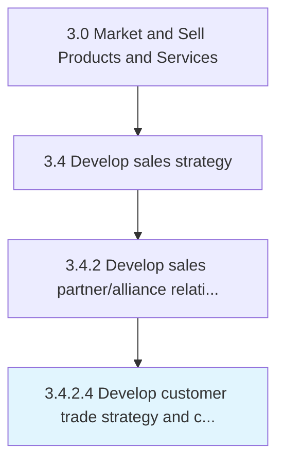

# Develop customer trade strategy and customer objectives/targets

> Implementing category management strategies for customers through the use of consumer insights and understanding of customer specifics.

## Overview

Activity 3.4.2.4 is an activity within the Market and Sell Products and Services framework. 

Implementing category management strategies for customers through the use of consumer insights and understanding of customer specifics. Develop consumer and channel insights. Establish long term strategies, objectives and targets across the brand.

## Process Hierarchy



## Key Statistics

| Metric | Value |
|--------|-------|
| APQC Code | 11465 |
| Hierarchy ID | 3.4.2.4 |
| Level | Activity |
| Parent | [3.4.2](../) |
| Sub-Processes | 0 |


## GraphDL Semantic Structure

```
develop.CustomerTradeStrategyAndCustomerObjectivestargets
```

| Component | Value | Description |
|-----------|-------|-------------|
| Verb | `develop` | Primary action |
| Object | `customer trade strategy and customer objectives/targets` | Direct object |


## Related Concepts

- CustomerTradeStrategyObjectives
- CustomerTradeStrategyTargets
- CustomerObjectives
- CustomerTargets


---

*Source: APQC PCF 11465 (3.4.2.4) - APQC*
