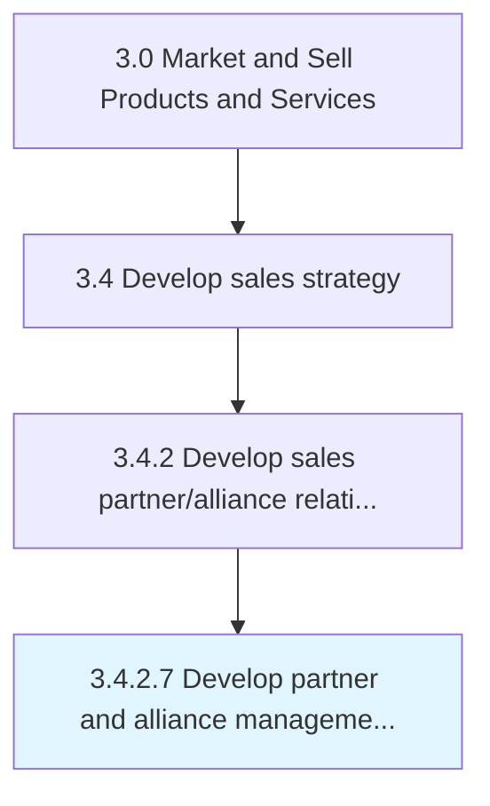

# Develop partner and alliance management strategies

> Designing strategies for effectively managing, identifying, and countering any possible issues from the alliance partnerships formed.

## Overview

Activity 3.4.2.7 is an activity within the Market and Sell Products and Services framework. 

Designing strategies for effectively managing, identifying, and countering any possible issues from the alliance partnerships formed. Create a strategic road map for managing the partnerships forged through Design alliance programs and methods for selecting and managing relationships [10139]. Determine where the alliance partnerships are headed, possible problems or pushback from the partners, how these issues might be countered, how these alliance partnerships would evolve in the future, any other business cases where these partnerships might be deployed, etc.

## Process Hierarchy



## Key Statistics

| Metric | Value |
|--------|-------|
| APQC Code | 10141 |
| Hierarchy ID | 3.4.2.7 |
| Level | Activity |
| Parent | [3.4.2](../) |
| Sub-Processes | 0 |


## GraphDL Semantic Structure

```
develop.PartnerAndAllianceManagementStrategies
```

| Component | Value | Description |
|-----------|-------|-------------|
| Verb | `develop` | Primary action |
| Object | `partner and alliance management strategies` | Direct object |


## Related Concepts

- PartnerManagementStrategies
- AllianceManagementStrategies


---

*Source: APQC PCF 10141 (3.4.2.7) - APQC*
