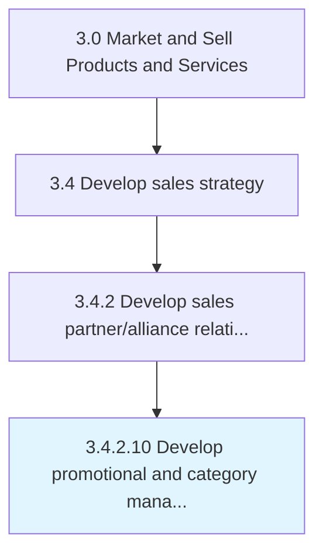

# Develop promotional and category management calendars (trade marketing calendars)

> Combining scheduled promotional, category management and trade marketing events into unified timetables.

## Overview

Activity 3.4.2.10 is an activity within the Market and Sell Products and Services framework. 

Combining scheduled promotional, category management and trade marketing events into unified timetables. Update the calendars. Register new events.

## Process Hierarchy



## Key Statistics

| Metric | Value |
|--------|-------|
| APQC Code | 11522 |
| Hierarchy ID | 3.4.2.10 |
| Level | Activity |
| Parent | [3.4.2](../) |
| Sub-Processes | 0 |


## GraphDL Semantic Structure

```
develop.PromotionalAndCategoryManagementCalendarsTradeMarketingCalendars
```

| Component | Value | Description |
|-----------|-------|-------------|
| Verb | `develop` | Primary action |
| Object | `promotional and category management calendars (trade marketing calendars)` | Direct object |


---

*Source: APQC PCF 11522 (3.4.2.10) - APQC*
