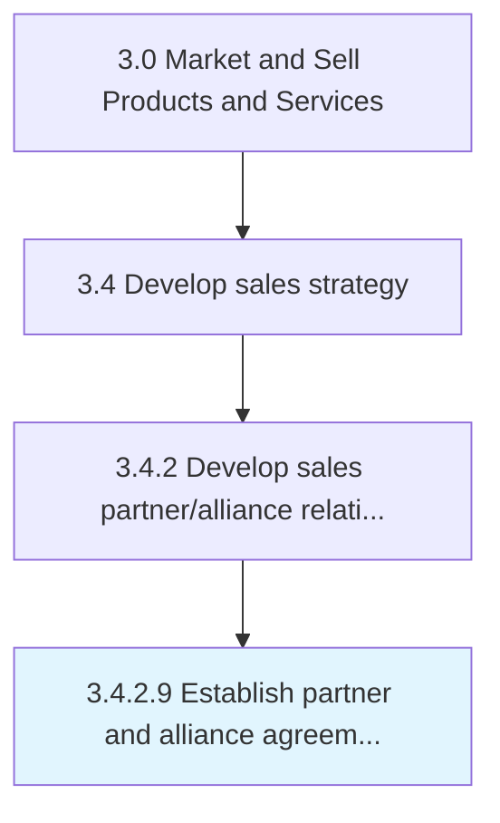

# Establish partner and alliance agreements

> Setting up strategic alliances with key trade partners and ratifying partnership agreements.

## Overview

Activity 3.4.2.9 is an activity within the Market and Sell Products and Services framework. 

Setting up strategic alliances with key trade partners and ratifying partnership agreements.

## Process Hierarchy



## Key Statistics

| Metric | Value |
|--------|-------|
| APQC Code | 18629 |
| Hierarchy ID | 3.4.2.9 |
| Level | Activity |
| Parent | [3.4.2](../) |
| Sub-Processes | 0 |


## GraphDL Semantic Structure

```
establish.PartnerAndAllianceAgreements
```

| Component | Value | Description |
|-----------|-------|-------------|
| Verb | `establish` | Primary action |
| Object | `partner and alliance agreements` | Direct object |


## Related Concepts

- [PartnerAgreements](/concepts/PartnerAgreements)
- [AllianceAgreements](/concepts/AllianceAgreements)


---

*Source: APQC PCF 18629 (3.4.2.9) - APQC*
