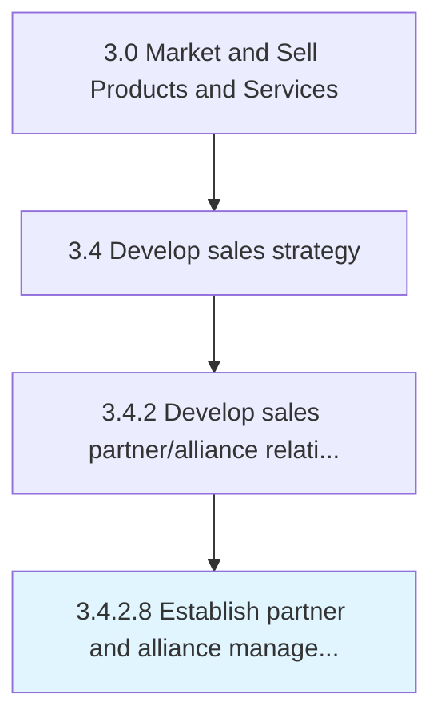

# Establish partner and alliance management goals

> Setting targets for organizational achievement.

## Overview

Activity 3.4.2.8 is an activity within the Market and Sell Products and Services framework. 

Setting targets for organizational achievement. This includes what the organization aims to achieve from and how it wishes to manage both the individual partners and the alliance as a whole. Set immediate through long-term goals including revenue targets, market penetration, footfall numbers, and geographical coverage.

## Process Hierarchy



## Key Statistics

| Metric | Value |
|--------|-------|
| APQC Code | 10142 |
| Hierarchy ID | 3.4.2.8 |
| Level | Activity |
| Parent | [3.4.2](../) |
| Sub-Processes | 0 |


## GraphDL Semantic Structure

```
establish.PartnerAndAllianceManagementGoals
```

| Component | Value | Description |
|-----------|-------|-------------|
| Verb | `establish` | Primary action |
| Object | `partner and alliance management goals` | Direct object |


## Related Concepts

- PartnerManagementGoals
- AllianceManagementGoals


---

*Source: APQC PCF 10142 (3.4.2.8) - APQC*
