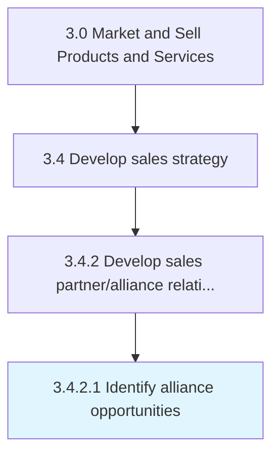

# Identify alliance opportunities

> Identifying collaboration opportunities for selling, marketing, and distributing the organization's products/services.

## Overview

Activity 3.4.2.1 is an activity within the Market and Sell Products and Services framework.

Identifying collaboration opportunities for selling, marketing, and distributing the organization's products/services. Determine any scope for partnering with other economic agents, with synergies for the marketing, sales, and/or distribution of the organization's products/services. Identify alliance opportunities that target customer segments who would be interested.

This process is critical to effective sales and marketing execution. It ensures that activities are systematically planned, executed, and measured against organizational objectives. When performed effectively, this process drives revenue growth, enhances customer engagement, and strengthens competitive positioning in target markets.

## Process Hierarchy



## Key Statistics

| Metric | Value |
|--------|-------|
| APQC Code | 10138 |
| Hierarchy ID | 3.4.2.1 |
| Level | Activity |
| Parent | [3.4.2](../) |
| Sub-Processes | 0 |

## Process Flow


## GraphDL Semantic Structure

```
identify.AllianceOpportunities
```

| Component | Value | Description |
|-----------|-------|-------------|
| Verb | `identify` | Primary action |
| Object | `alliance opportunities` | Direct object |


## RACI Matrix

| Role | Responsible | Accountable | Consulted | Informed |
|------|:-----------:|:-----------:|:---------:|:--------:|
| Sales Manager | R |  |  |  |
| VP Sales |  | A |  |  |
| Financial Analyst |  |  | C |  |
| Marketing Manager |  |  | C |  |
| Executive Leadership |  |  |  | I |

## Related Occupations

- [Sales Managers](/occupations/Management/SalesManagers)
- [Market Research Analysts](/occupations/Business-and-Financial-Operations/MarketResearchAnalysts)
- [Sales Representatives Wholesale And Manufacturing](/occupations/Sales-and-Related/SalesRepresentativesWholesaleAndManufacturing)
- [Financial Analysts](/occupations/Business-and-Financial-Operations/FinancialAnalysts)
- [Marketing Managers](/occupations/Management/MarketingManagers)

## Related Departments

- [Sales](/departments/Sales)
- [Finance](/departments/Finance)
- [Marketing](/departments/Marketing)

## Industry Variations

### Manufacturing

In manufacturing, identify alliance opportunities involves long sales cycles, technical selling approaches, distributor network management, and volume-based pricing models.

### Retail

In retail, identify alliance opportunities focuses on seasonal demand forecasting, store-level sales planning, and category management strategies.

### Technology

In technology, identify alliance opportunities emphasizes subscription-based revenue models, partner ecosystem development, and solution selling methodologies.

## KPIs & Metrics

| Metric | Description | Target |
|--------|-------------|--------|
| Sales Forecast Accuracy | Variance between forecasted and actual sales | <10% variance |
| Pipeline Coverage Ratio | Ratio of pipeline value to sales target | >3:1 |
| Partner Revenue Contribution | Percentage of revenue generated through partners | >25% |
| Sales Budget Efficiency | Revenue generated per dollar of sales budget | >5:1 |

## Related Concepts

- AllianceOpportunities

---

*Source: APQC PCF 10138 (3.4.2.1) - APQC*
