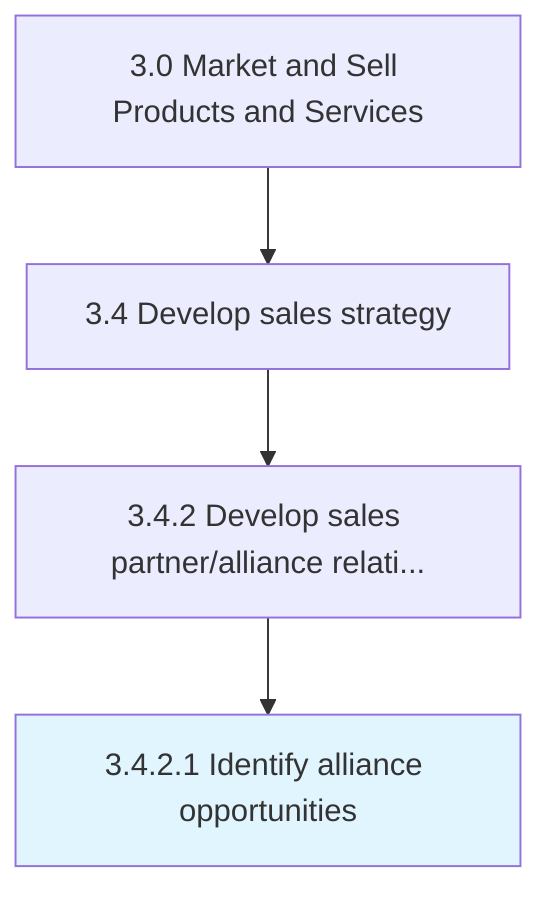

# Identify alliance opportunities

> Identifying collaboration opportunities for selling, marketing, and distributing the organization's products/services.

## Overview

Activity 3.4.2.1 is an activity within the Market and Sell Products and Services framework. 

Identifying collaboration opportunities for selling, marketing, and distributing the organization's products/services. Determine any scope for partnering with other economic agents, with synergies for the marketing, sales, and/or distribution of the organization's products/services. Identify alliance opportunities that target customer segments who would be interested.

## Process Hierarchy



## Key Statistics

| Metric | Value |
|--------|-------|
| APQC Code | 10138 |
| Hierarchy ID | 3.4.2.1 |
| Level | Activity |
| Parent | [3.4.2](../) |
| Sub-Processes | 0 |


## GraphDL Semantic Structure

```
identify.AllianceOpportunities
```

| Component | Value | Description |
|-----------|-------|-------------|
| Verb | `identify` | Primary action |
| Object | `alliance opportunities` | Direct object |


## Related Concepts

- AllianceOpportunities


---

*Source: APQC PCF 10138 (3.4.2.1) - APQC*
