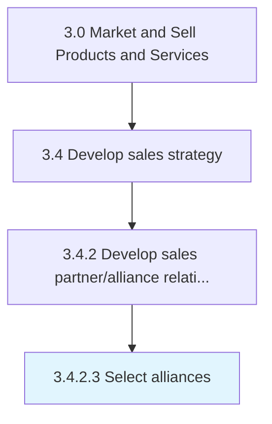

# Select alliances

> Choosing alliance partners using the selected programs and methodology.

## Overview

Activity 3.4.2.3 is an activity within the Market and Sell Products and Services framework. 

Choosing alliance partners using the selected programs and methodology. Select the most feasible and profitable alliance partners, based on Design alliance programs and methods for selecting and managing relationships [10139] and through a careful scrutiny of the potential alliance.

## Process Hierarchy



## Key Statistics

| Metric | Value |
|--------|-------|
| APQC Code | 10140 |
| Hierarchy ID | 3.4.2.3 |
| Level | Activity |
| Parent | [3.4.2](../) |
| Sub-Processes | 0 |


## GraphDL Semantic Structure

```
select.Alliances
```

| Component | Value | Description |
|-----------|-------|-------------|
| Verb | `select` | Primary action |
| Object | `alliances` | Direct object |


## Related Concepts

- [Alliances](/concepts/Alliances)


---

*Source: APQC PCF 10140 (3.4.2.3) - APQC*
