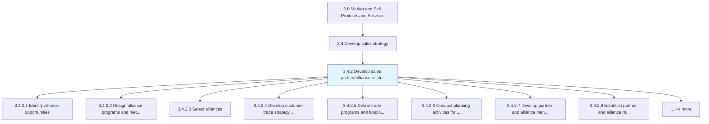
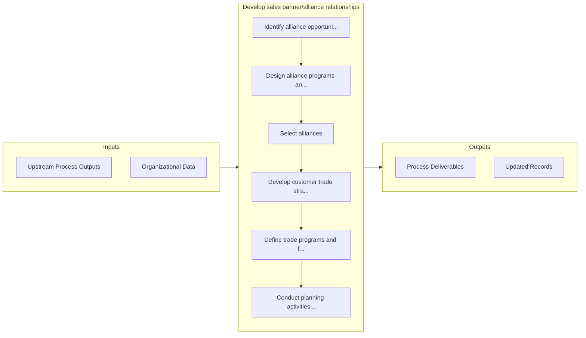

# Develop sales partner/alliance relationships

> Cultivating an alliance of partners by identifying, analyzing, negotiating, and managing partnerships with other economic agents.

## Overview

Process 3.4.2 is a core process that defines the specific procedures for develop sales partner/alliance relationships. 

Cultivating an alliance of partners by identifying, analyzing, negotiating, and managing partnerships with other economic agents.

## Process Hierarchy



## Key Statistics

| Metric | Value |
|--------|-------|
| APQC Code | 10130 |
| Hierarchy ID | 3.4.2 |
| Level | Process |
| Parent | [3.4](../) |
| Sub-Processes | 12 |


## GraphDL Semantic Structure

```graphdl
develop.SalesPartnerallianceRelationships
```

| Component | Value | Description |
|-----------|-------|-------------|
| Verb | `develop` | Primary action |
| Object | `sales partner/alliance relationships` | Direct object |


## Process Flow



## Sub-Processes

| Process | Hierarchy ID | Description |
|---------|-------------|-------------|
| [Identify alliance opportunities](./IdentifyAllianceOpportunities) | 3.4.2.1 | Identifying collaboration opportunities for selling, marketing, and distributing the organization's  |
| [Design alliance programs and methods for selecting and managing relationships](./DesignAllianceProgramsAndMethodsForSelectingAndManagingRelationships) | 3.4.2.2 | Creating the frameworks needed to select alliance partners, and maintaining relationships with them |
| [Select alliances](./SelectAlliances) | 3.4.2.3 | Choosing alliance partners using the selected programs and methodology |
| [Develop customer trade strategy and customer objectives/targets](./DevelopCustomerTradeStrategyAndCustomerObjectivestargets) | 3.4.2.4 | Implementing category management strategies for customers through the use of consumer insights and u |
| [Define trade programs and funding options](./DefineTradeProgramsAndFundingOptions) | 3.4.2.5 | Establishing business-to-business marketing campaigns and financial incentives for wholesalers, deal |
| [Conduct planning activities for major trade customers](./ConductPlanningActivitiesForMajorTradeCustomers) | 3.4.2.6 | Arranging meetings with trade partners to coordinate logistics, manage critical resources, resolve b |
| [Develop partner and alliance management strategies](./DevelopPartnerAndAllianceManagementStrategies) | 3.4.2.7 | Designing strategies for effectively managing, identifying, and countering any possible issues from  |
| [Establish partner and alliance management goals](./EstablishPartnerAndAllianceManagementGoals) | 3.4.2.8 | Setting targets for organizational achievement |
| [Establish partner and alliance agreements](./EstablishPartnerAndAllianceAgreements) | 3.4.2.9 | Setting up strategic alliances with key trade partners and ratifying partnership agreements |
| [Develop promotional and category management calendars (trade marketing calendars)](./DevelopPromotionalAndCategoryManagementCalendarsTradeMarketingCalendars) | 3.4.2.10 | Combining scheduled promotional, category management and trade marketing events into unified timetab |
| [Create strategic and tactical sales plans by customer](./CreateStrategicAndTacticalSalesPlansByCustomer) | 3.4.2.11 | Establishing long term customer sales plans to assess current sales and to determine future sales ob |
| [Communicate planning information to customer teams](./CommunicatePlanningInformationToCustomerTeams) | 3.4.2.12 | Sending invitations and distributing information about upcoming events to customer teams and other i |


## Related Concepts

- SalesPartnerRelationships
- SalesAllianceRelationships


---

*Source: APQC PCF 10130 (3.4.2) - APQC*
