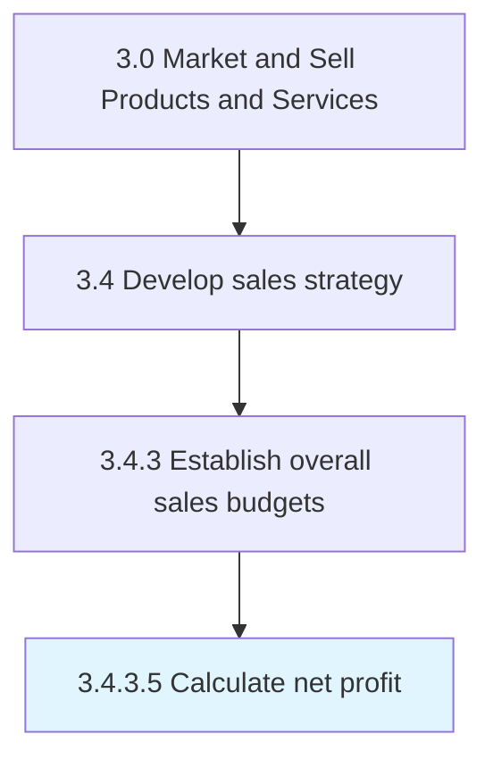

# Calculate net profit

> Calculating the net income.

## Overview

Activity 3.4.3.5 is an activity within the Market and Sell Products and Services framework. 

Calculating the net income. Calculate the organization's profitability by accounting for Determine overhead and fixed costs [10145] and Determine variable costs [10144].

## Process Hierarchy



## Key Statistics

| Metric | Value |
|--------|-------|
| APQC Code | 10146 |
| Hierarchy ID | 3.4.3.5 |
| Level | Activity |
| Parent | [3.4.3](../) |
| Sub-Processes | 0 |


## GraphDL Semantic Structure

```
calculate.NetProfit
```

| Component | Value | Description |
|-----------|-------|-------------|
| Verb | `calculate` | Primary action |
| Object | `net profit` | Direct object |


## Related Concepts

- NetProfit


---

*Source: APQC PCF 10146 (3.4.3.5) - APQC*
