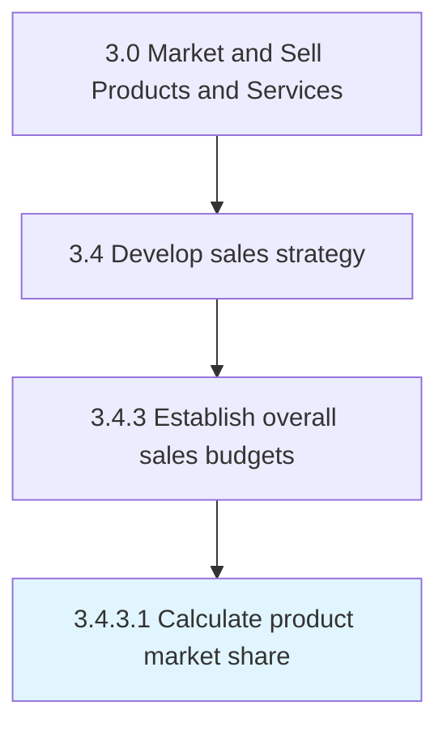

# Calculate product market share

> Determining the percentage of total sales volume in the market for a particular product.

## Overview

Activity 3.4.3.1 is an activity within the Market and Sell Products and Services framework. 

Determining the percentage of total sales volume in the market for a particular product.

## Process Hierarchy



## Key Statistics

| Metric | Value |
|--------|-------|
| APQC Code | 17682 |
| Hierarchy ID | 3.4.3.1 |
| Level | Activity |
| Parent | [3.4.3](../) |
| Sub-Processes | 0 |


## GraphDL Semantic Structure

```
calculate.ProductMarketShare
```

| Component | Value | Description |
|-----------|-------|-------------|
| Verb | `calculate` | Primary action |
| Object | `product market share` | Direct object |


## Related Concepts

- [ProductMarketShare](/concepts/ProductMarketShare)


---

*Source: APQC PCF 17682 (3.4.3.1) - APQC*
