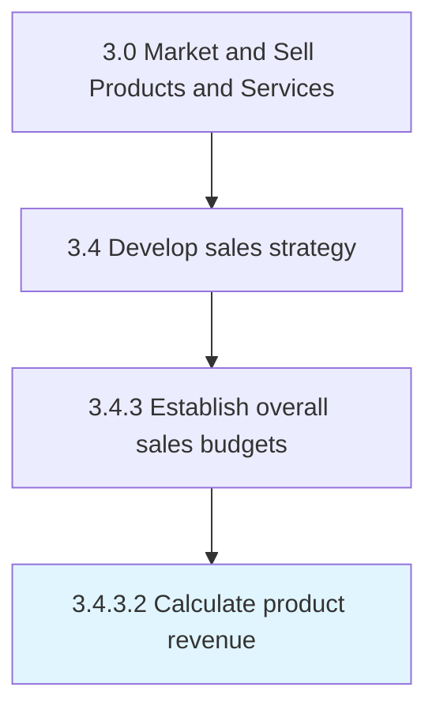

# Calculate product revenue

> Estimating revenue from the sale of products/services.

## Overview

Activity 3.4.3.2 is an activity within the Market and Sell Products and Services framework. 

Estimating revenue from the sale of products/services. Approximate the anticipated sale of products/services and multiply it by the selling price of the respective offering. (This represents the total amount of money that the organization receives from the sale of its portfolio of offerings.)

## Process Hierarchy



## Key Statistics

| Metric | Value |
|--------|-------|
| APQC Code | 10143 |
| Hierarchy ID | 3.4.3.2 |
| Level | Activity |
| Parent | [3.4.3](../) |
| Sub-Processes | 0 |


## GraphDL Semantic Structure

```
calculate.ProductRevenue
```

| Component | Value | Description |
|-----------|-------|-------------|
| Verb | `calculate` | Primary action |
| Object | `product revenue` | Direct object |


## Related Concepts

- ProductRevenue


---

*Source: APQC PCF 10143 (3.4.3.2) - APQC*
