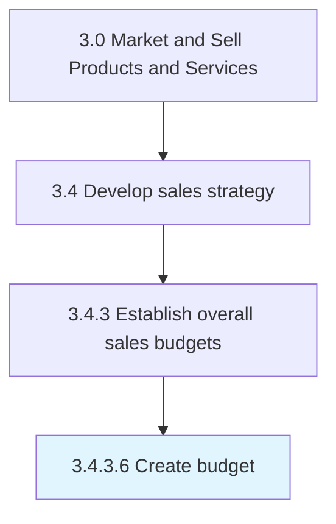

# Create budget

> Creating a plan in measurable terms for the financial outlay that best captures resource allocation for the sales forecast.

## Overview

Activity 3.4.3.6 is an activity within the Market and Sell Products and Services framework. 

Creating a plan in measurable terms for the financial outlay that best captures resource allocation for the sales forecast. Consider the outlay of capital, HR, raw materials, and provisions needed to reach sales targets.

## Process Hierarchy



## Key Statistics

| Metric | Value |
|--------|-------|
| APQC Code | 10147 |
| Hierarchy ID | 3.4.3.6 |
| Level | Activity |
| Parent | [3.4.3](../) |
| Sub-Processes | 0 |


## GraphDL Semantic Structure

```
create.Budget
```

| Component | Value | Description |
|-----------|-------|-------------|
| Verb | `create` | Primary action |
| Object | `budget` | Direct object |


## Related Concepts

- [Budget](/concepts/Budget)


---

*Source: APQC PCF 10147 (3.4.3.6) - APQC*
