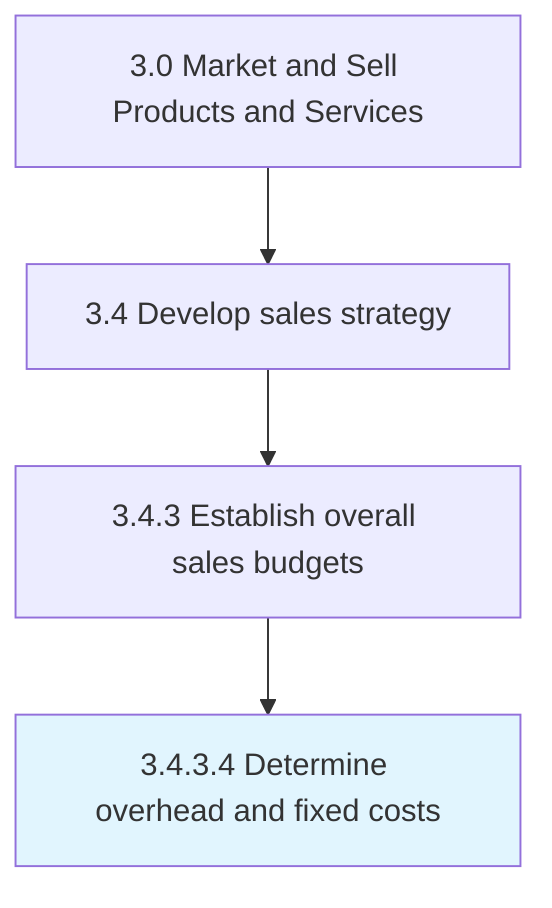

# Determine overhead and fixed costs

> Calculating the overhead costs associated with selling the organization's products/services.

## Overview

Activity 3.4.3.4 is an activity within the Market and Sell Products and Services framework. 

Calculating the overhead costs associated with selling the organization's products/services. Determine fixed costs that are not directly related to the volume of products/services processed or the sale of these offerings (e.g., expense over machinery and equipment).

## Process Hierarchy



## Key Statistics

| Metric | Value |
|--------|-------|
| APQC Code | 10145 |
| Hierarchy ID | 3.4.3.4 |
| Level | Activity |
| Parent | [3.4.3](../) |
| Sub-Processes | 0 |


## GraphDL Semantic Structure

```
determine.OverheadAndFixedCosts
```

| Component | Value | Description |
|-----------|-------|-------------|
| Verb | `determine` | Primary action |
| Object | `overhead and fixed costs` | Direct object |


## Related Concepts

- Overhead
- FixedCosts


---

*Source: APQC PCF 10145 (3.4.3.4) - APQC*
