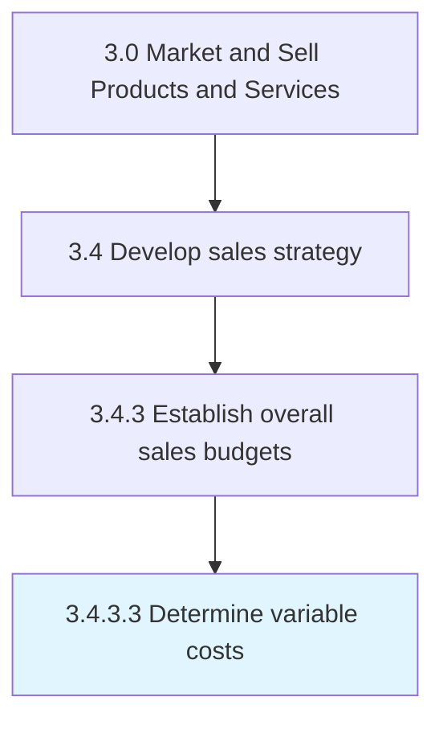

# Determine variable costs

> Calculating the variable costs of production.

## Overview

Activity 3.4.3.3 is an activity within the Market and Sell Products and Services framework. 

Calculating the variable costs of production. Approximate those costs that depend on the volume of products/services produced by the organization.

## Process Hierarchy



## Key Statistics

| Metric | Value |
|--------|-------|
| APQC Code | 10144 |
| Hierarchy ID | 3.4.3.3 |
| Level | Activity |
| Parent | [3.4.3](../) |
| Sub-Processes | 0 |


## GraphDL Semantic Structure

```
determine.VariableCosts
```

| Component | Value | Description |
|-----------|-------|-------------|
| Verb | `determine` | Primary action |
| Object | `variable costs` | Direct object |


## Related Concepts

- VariableCosts


---

*Source: APQC PCF 10144 (3.4.3.3) - APQC*
