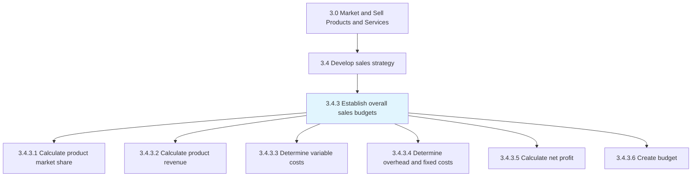
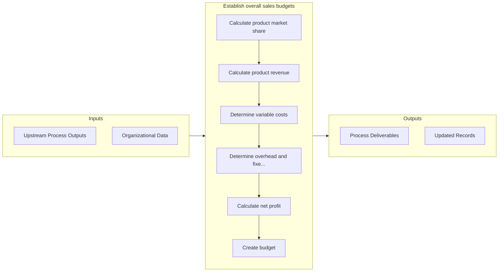

# Establish overall sales budgets

> Setting up a financial plan for the sales function.

## Overview

Process 3.4.3 is a core process that defines the specific procedures for establish overall sales budgets. 

Setting up a financial plan for the sales function. Calculate the estimated sales revenue and costs, which helps in calculating the overall net profit. Create a sound plan for resource outlay by comparing the forecast with historical data.

## Process Hierarchy



## Key Statistics

| Metric | Value |
|--------|-------|
| APQC Code | 10131 |
| Hierarchy ID | 3.4.3 |
| Level | Process |
| Parent | [3.4](../) |
| Sub-Processes | 6 |


## GraphDL Semantic Structure

```graphdl
establish.OverallSalesBudgets
```

| Component | Value | Description |
|-----------|-------|-------------|
| Verb | `establish` | Primary action |
| Object | `overall sales budgets` | Direct object |


## Process Flow



## Sub-Processes

| Process | Hierarchy ID | Description |
|---------|-------------|-------------|
| [Calculate product market share](./CalculateProductMarketShare) | 3.4.3.1 | Determining the percentage of total sales volume in the market for a particular product |
| [Calculate product revenue](./CalculateProductRevenue) | 3.4.3.2 | Estimating revenue from the sale of products/services |
| [Determine variable costs](./DetermineVariableCosts) | 3.4.3.3 | Calculating the variable costs of production |
| [Determine overhead and fixed costs](./DetermineOverheadAndFixedCosts) | 3.4.3.4 | Calculating the overhead costs associated with selling the organization's products/services |
| [Calculate net profit](./CalculateNetProfit) | 3.4.3.5 | Calculating the net income |
| [Create budget](./CreateBudget) | 3.4.3.6 | Creating a plan in measurable terms for the financial outlay that best captures resource allocation  |


## Related Concepts

- OverallSalesBudgets


---

*Source: APQC PCF 10131 (3.4.3) - APQC*
