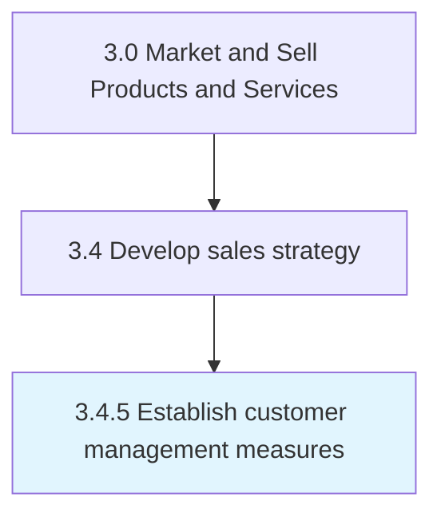

# Establish customer management measures

> Identifying the appropriate measures that can represent key attributes of the customer management function.

## Overview

Process 3.4.5 is a core process that defines the specific procedures for establish customer management measures. 

Identifying the appropriate measures that can represent key attributes of the customer management function. Select measures to track customer activity, feedback, satisfaction, organizational responsiveness to customer needs, and general data on how the organization is managing customer accounts, leads, and contacts. Build on customer and market intelligence to identify metrics gauging aspects related to customer management. Select measures based on the nature of the business, the type and size of customer base, strategic goals, and the model used to structure sales and customer relationships.

## Process Hierarchy



## Key Statistics

| Metric | Value |
|--------|-------|
| APQC Code | 10133 |
| Hierarchy ID | 3.4.5 |
| Level | Process |
| Parent | [3.4](../) |
| Sub-Processes | 0 |


## GraphDL Semantic Structure

```
establish.CustomerManagementMeasures
```

| Component | Value | Description |
|-----------|-------|-------------|
| Verb | `establish` | Primary action |
| Object | `customer management measures` | Direct object |


## Related Concepts

- [CustomerManagementMeasures](/concepts/CustomerManagementMeasures)


---

*Source: APQC PCF 10133 (3.4.5) - APQC*
