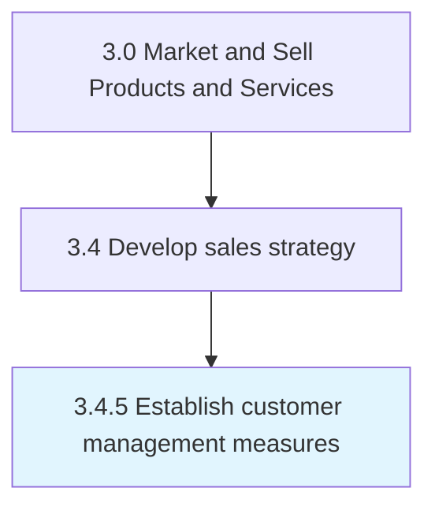

# Establish customer management measures

> Identifying the appropriate measures that can represent key attributes of the customer management function.

## Overview

Process 3.4.5 is an activity within the Market and Sell Products and Services framework.

Identifying the appropriate measures that can represent key attributes of the customer management function. Select measures to track customer activity, feedback, satisfaction, organizational responsiveness to customer needs, and general data on how the organization is managing customer accounts, leads, and contacts. Build on customer and market intelligence to identify metrics gauging aspects related to customer management. Select measures based on the nature of the business, the type and size of customer base, strategic goals, and the model used to structure sales and customer relationships.

This process is critical to effective sales and marketing execution. It ensures that activities are systematically planned, executed, and measured against organizational objectives. When performed effectively, this process drives revenue growth, enhances customer engagement, and strengthens competitive positioning in target markets.

## Process Hierarchy



## Key Statistics

| Metric | Value |
|--------|-------|
| APQC Code | 10133 |
| Hierarchy ID | 3.4.5 |
| Level | Process |
| Parent | [3.4](../) |
| Sub-Processes | 0 |

## Process Flow


## GraphDL Semantic Structure

```
establish.CustomerManagementMeasures
```

| Component | Value | Description |
|-----------|-------|-------------|
| Verb | `establish` | Primary action |
| Object | `customer management measures` | Direct object |


## RACI Matrix

| Role | Responsible | Accountable | Consulted | Informed |
|------|:-----------:|:-----------:|:---------:|:--------:|
| Sales Manager | R |  |  |  |
| VP Sales |  | A |  |  |
| Financial Analyst |  |  | C |  |
| Marketing Manager |  |  | C |  |
| Executive Leadership |  |  |  | I |

## Related Occupations

- [Sales Managers](/occupations/Management/SalesManagers)
- [Market Research Analysts](/occupations/Business-and-Financial-Operations/MarketResearchAnalysts)
- [Sales Representatives Wholesale And Manufacturing](/occupations/Sales-and-Related/SalesRepresentativesWholesaleAndManufacturing)
- [Financial Analysts](/occupations/Business-and-Financial-Operations/FinancialAnalysts)
- [Marketing Managers](/occupations/Management/MarketingManagers)

## Related Departments

- [Sales](/departments/Sales)
- [Finance](/departments/Finance)
- [Marketing](/departments/Marketing)

## Industry Variations

### Manufacturing

In manufacturing, establish customer management measures involves long sales cycles, technical selling approaches, distributor network management, and volume-based pricing models.

### Retail

In retail, establish customer management measures focuses on seasonal demand forecasting, store-level sales planning, and category management strategies.

### Technology

In technology, establish customer management measures emphasizes subscription-based revenue models, partner ecosystem development, and solution selling methodologies.

## KPIs & Metrics

| Metric | Description | Target |
|--------|-------------|--------|
| Sales Forecast Accuracy | Variance between forecasted and actual sales | <10% variance |
| Pipeline Coverage Ratio | Ratio of pipeline value to sales target | >3:1 |
| Partner Revenue Contribution | Percentage of revenue generated through partners | >25% |
| Sales Budget Efficiency | Revenue generated per dollar of sales budget | >5:1 |

## Related Concepts

- CustomerManagementMeasures

---

*Source: APQC PCF 10133 (3.4.5) - APQC*
