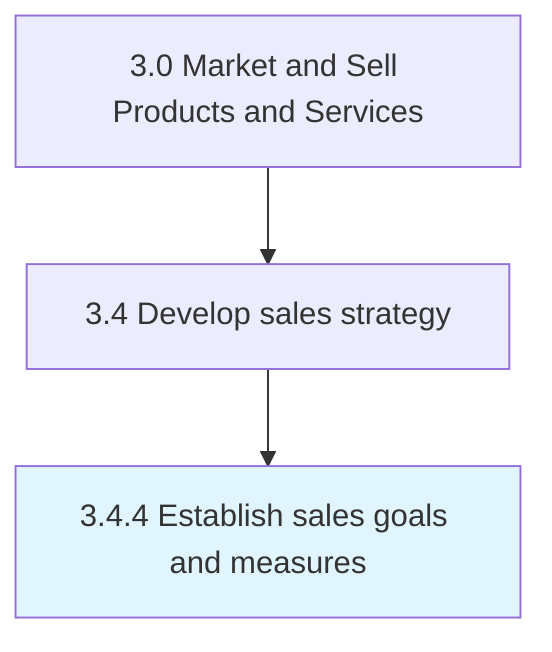

# Establish sales goals and measures

> Establishing specific quantitative and qualitative measures of realizing sales targets.

## Overview

Process 3.4.4 is a core process that defines the specific procedures for establish sales goals and measures. 

Establishing specific quantitative and qualitative measures of realizing sales targets. Create sales targets by analyzing historical sales data and comparing the forecasts to results, in light of customer and market intelligence. Examine the performance of sales personnel in light of market opportunities. Based on this review, establish sales targets along with metrics to quantify these goals, corresponding with the overall business strategy.

## Process Hierarchy



## Key Statistics

| Metric | Value |
|--------|-------|
| APQC Code | 10132 |
| Hierarchy ID | 3.4.4 |
| Level | Process |
| Parent | [3.4](../) |
| Sub-Processes | 0 |


## GraphDL Semantic Structure

```
establish.SalesGoalsAndMeasures
```

| Component | Value | Description |
|-----------|-------|-------------|
| Verb | `establish` | Primary action |
| Object | `sales goals and measures` | Direct object |


## Related Concepts

- SalesGoals
- Measures


---

*Source: APQC PCF 10132 (3.4.4) - APQC*
