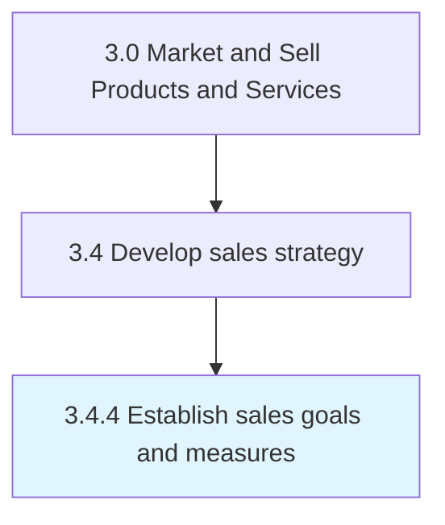

# Establish sales goals and measures

> Establishing specific quantitative and qualitative measures of realizing sales targets.

## Overview

Process 3.4.4 is an activity within the Market and Sell Products and Services framework.

Establishing specific quantitative and qualitative measures of realizing sales targets. Create sales targets by analyzing historical sales data and comparing the forecasts to results, in light of customer and market intelligence. Examine the performance of sales personnel in light of market opportunities. Based on this review, establish sales targets along with metrics to quantify these goals, corresponding with the overall business strategy.

This process is critical to effective sales and marketing execution. It ensures that activities are systematically planned, executed, and measured against organizational objectives. When performed effectively, this process drives revenue growth, enhances customer engagement, and strengthens competitive positioning in target markets.

## Process Hierarchy



## Key Statistics

| Metric | Value |
|--------|-------|
| APQC Code | 10132 |
| Hierarchy ID | 3.4.4 |
| Level | Process |
| Parent | [3.4](../) |
| Sub-Processes | 0 |

## Process Flow


## GraphDL Semantic Structure

```
establish.SalesGoalsAndMeasures
```

| Component | Value | Description |
|-----------|-------|-------------|
| Verb | `establish` | Primary action |
| Object | `sales goals and measures` | Direct object |


## RACI Matrix

| Role | Responsible | Accountable | Consulted | Informed |
|------|:-----------:|:-----------:|:---------:|:--------:|
| Sales Manager | R |  |  |  |
| VP Sales |  | A |  |  |
| Financial Analyst |  |  | C |  |
| Marketing Manager |  |  | C |  |
| Executive Leadership |  |  |  | I |

## Related Occupations

- [Sales Managers](/occupations/Management/SalesManagers)
- [Market Research Analysts](/occupations/Business-and-Financial-Operations/MarketResearchAnalysts)
- [Sales Representatives Wholesale And Manufacturing](/occupations/Sales-and-Related/SalesRepresentativesWholesaleAndManufacturing)
- [Financial Analysts](/occupations/Business-and-Financial-Operations/FinancialAnalysts)
- [Marketing Managers](/occupations/Management/MarketingManagers)

## Related Departments

- [Sales](/departments/Sales)
- [Finance](/departments/Finance)
- [Marketing](/departments/Marketing)

## Industry Variations

### Manufacturing

In manufacturing, establish sales goals and measures involves long sales cycles, technical selling approaches, distributor network management, and volume-based pricing models.

### Retail

In retail, establish sales goals and measures focuses on seasonal demand forecasting, store-level sales planning, and category management strategies.

### Technology

In technology, establish sales goals and measures emphasizes subscription-based revenue models, partner ecosystem development, and solution selling methodologies.

## KPIs & Metrics

| Metric | Description | Target |
|--------|-------------|--------|
| Sales Forecast Accuracy | Variance between forecasted and actual sales | <10% variance |
| Pipeline Coverage Ratio | Ratio of pipeline value to sales target | >3:1 |
| Partner Revenue Contribution | Percentage of revenue generated through partners | >25% |
| Sales Budget Efficiency | Revenue generated per dollar of sales budget | >5:1 |

## Related Concepts

- SalesGoals
- Measures

---

*Source: APQC PCF 10132 (3.4.4) - APQC*
