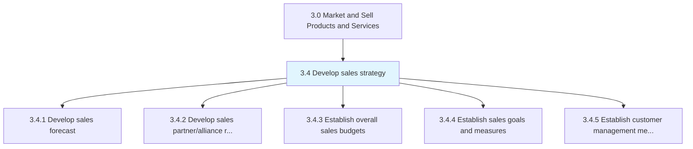
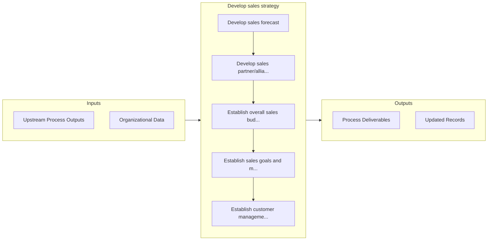

# Develop sales strategy

> Developing concrete plans for guiding and providing support to the sales function.

## Overview

Group 3.4 is a process group within APQC Category 3.0 (Market and Sell Products and Services). 

Developing concrete plans for guiding and providing support to the sales function. Chart a road map for the sales function, including an analysis of historical sales data to create forecasts for anticipated sales, forming sales targets, forging partnerships with other economic agents to boost sales, devising a budget for this function, and determining metrics to measure customer management activities as well as progress in achieving sales targets.

## Process Hierarchy



## Key Statistics

| Metric | Value |
|--------|-------|
| APQC Code | 10103 |
| Hierarchy ID | 3.4 |
| Level | Group |
| Parent | [3](../) |
| Sub-Processes | 5 |


## GraphDL Semantic Structure

```
develop.SalesStrategy
```

| Component | Value | Description |
|-----------|-------|-------------|
| Verb | `develop` | Primary action |
| Object | `sales strategy` | Direct object |


## Process Flow



## Sub-Processes

| Process | Hierarchy ID | Description |
|---------|-------------|-------------|
| [Develop sales forecast](./3.4.1-DevelopSalesForecast/) | 3.4.1 | Developing a sales forecast for the organization's portfolio of offerings, bearing in mind the effec |
| [Develop sales partner/alliance relationships](./3.4.2-DevelopSalesPartnerallianceRelationships/) | 3.4.2 | Cultivating an alliance of partners by identifying, analyzing, negotiating, and managing partnership |
| [Establish overall sales budgets](./3.4.3-EstablishOverallSalesBudgets/) | 3.4.3 | Setting up a financial plan for the sales function |
| [Establish sales goals and measures](./EstablishSalesGoalsAndMeasures) | 3.4.4 | Establishing specific quantitative and qualitative measures of realizing sales targets |
| [Establish customer management measures](./EstablishCustomerManagementMeasures) | 3.4.5 | Identifying the appropriate measures that can represent key attributes of the customer management fu |


## Related Concepts

- [SalesStrategy](/concepts/SalesStrategy)


---

*Source: APQC PCF 10103 (3.4) - APQC*
