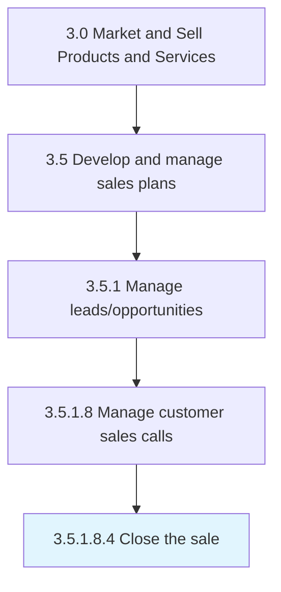

# Close the sale

> Formalizing a sale by reaching an agreement on terms of the deal.

## Overview

Sub-Activity 3.5.1.8.4 is an activity within the Market and Sell Products and Services framework. 

Formalizing a sale by reaching an agreement on terms of the deal. Negotiate on the price, and reach a consensus on the terms and conditions.

## Process Hierarchy



## Key Statistics

| Metric | Value |
|--------|-------|
| APQC Code | 10192 |
| Hierarchy ID | 3.5.1.8.4 |
| Level | Sub-Activity |
| Parent | [3.5.1.8](../) |
| Sub-Processes | 0 |


## GraphDL Semantic Structure

```
close.TheSale
```

| Component | Value | Description |
|-----------|-------|-------------|
| Verb | `close` | Primary action |
| Object | `the sale` | Direct object |


## Related Concepts

- [Sale](/concepts/Sale)


---

*Source: APQC PCF 10192 (3.5.1.8.4) - APQC*
