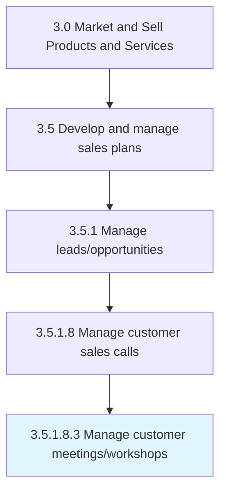

# Manage customer meetings/workshops

> Arranging and leading meetings, seminars, workshops and training events with customers to educate them about current offerings, best practices and technological advances to provide more value to customers and to increase their attrition and loyalty.

## Overview

Sub-Activity 3.5.1.8.3 is an activity within the Market and Sell Products and Services framework. 

Arranging and leading meetings, seminars, workshops and training events with customers to educate them about current offerings, best practices and technological advances to provide more value to customers and to increase their attrition and loyalty.

## Process Hierarchy



## Key Statistics

| Metric | Value |
|--------|-------|
| APQC Code | 20012 |
| Hierarchy ID | 3.5.1.8.3 |
| Level | Sub-Activity |
| Parent | [3.5.1.8](../) |
| Sub-Processes | 0 |


## GraphDL Semantic Structure

```
manage.CustomerMeetingsworkshops
```

| Component | Value | Description |
|-----------|-------|-------------|
| Verb | `manage` | Primary action |
| Object | `customer meetings/workshops` | Direct object |


## Related Concepts

- [CustomerMeetings](/concepts/CustomerMeetings)
- [CustomerWorkshops](/concepts/CustomerWorkshops)


---

*Source: APQC PCF 20012 (3.5.1.8.3) - APQC*
