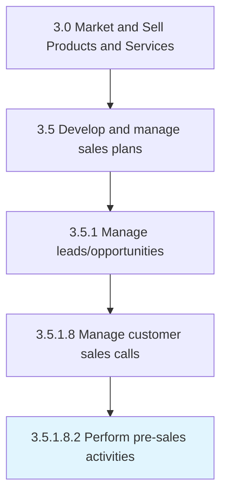

# Perform pre-sales activities

> Capitalizing on sales calls by pitching on bids and closing deals.

## Overview

Sub-Activity 3.5.1.8.2 is an activity within the Market and Sell Products and Services framework. 

Capitalizing on sales calls by pitching on bids and closing deals. Outline the nature and scope of the work, draft agreement terms, prepare proposals and agreements, and propose timelines and prices.

## Process Hierarchy



## Key Statistics

| Metric | Value |
|--------|-------|
| APQC Code | 10191 |
| Hierarchy ID | 3.5.1.8.2 |
| Level | Sub-Activity |
| Parent | [3.5.1.8](../) |
| Sub-Processes | 0 |


## GraphDL Semantic Structure

```
perform.PresalesActivities
```

| Component | Value | Description |
|-----------|-------|-------------|
| Verb | `perform` | Primary action |
| Object | `pre-sales activities` | Direct object |


---

*Source: APQC PCF 10191 (3.5.1.8.2) - APQC*
