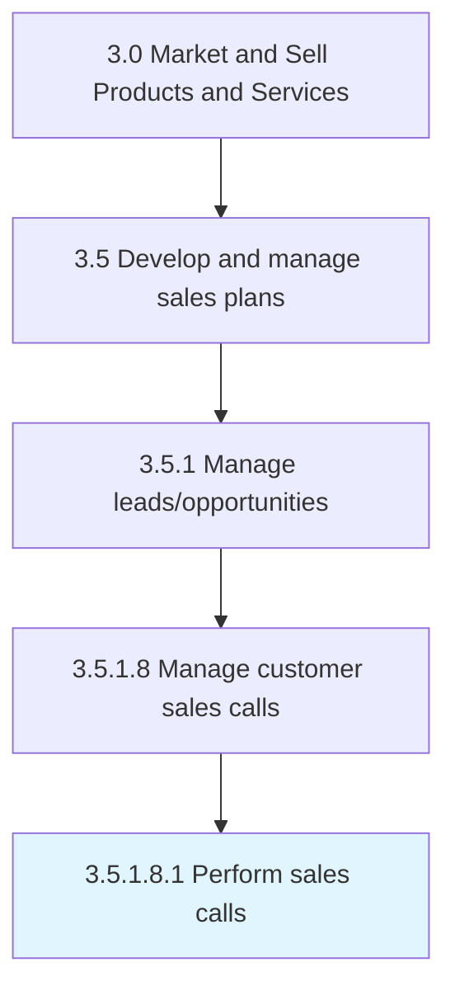

# Perform sales calls

> Communicating with customers and prospects with the intent of creating sales opportunities.

## Overview

Sub-Activity 3.5.1.8.1 is an activity within the Market and Sell Products and Services framework. 

Communicating with customers and prospects with the intent of creating sales opportunities. Reach out to existing and prospective customers through alternate media and networking channels, apart from cold calling/emailing.

## Process Hierarchy



## Key Statistics

| Metric | Value |
|--------|-------|
| APQC Code | 10190 |
| Hierarchy ID | 3.5.1.8.1 |
| Level | Sub-Activity |
| Parent | [3.5.1.8](../) |
| Sub-Processes | 0 |


## GraphDL Semantic Structure

```
perform.SalesCalls
```

| Component | Value | Description |
|-----------|-------|-------------|
| Verb | `perform` | Primary action |
| Object | `sales calls` | Direct object |


## Related Concepts

- SalesCalls


---

*Source: APQC PCF 10190 (3.5.1.8.1) - APQC*
