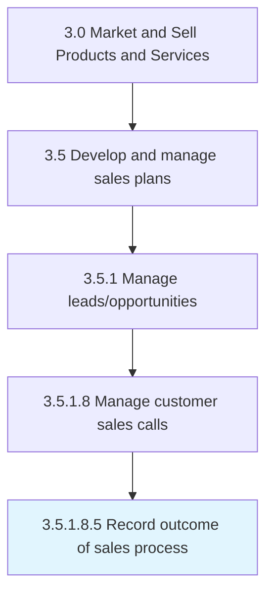

# Record outcome of sales process

> Completing all the paper-work associated with the sale of its products/services.

## Overview

Sub-Activity 3.5.1.8.5 is an activity within the Market and Sell Products and Services framework. 

Completing all the paper-work associated with the sale of its products/services. Exchange any pertinent legal/financial information required for completing the sale, signing of a contract/work-order, and issuing copies of bills/invoices.

## Process Hierarchy



## Key Statistics

| Metric | Value |
|--------|-------|
| APQC Code | 10193 |
| Hierarchy ID | 3.5.1.8.5 |
| Level | Sub-Activity |
| Parent | [3.5.1.8](../) |
| Sub-Processes | 0 |


## GraphDL Semantic Structure

```
record.Outcome.of.SalesProcess
```

| Component | Value | Description |
|-----------|-------|-------------|
| Verb | `record` | Primary action |
| Object | `outcome` | Direct object |
| Preposition | `of` | Relationship |
| PrepObject | `sales process` | Indirect object |


## Related Concepts

- [Outcome](/concepts/Outcome)
- [SalesProcess](/concepts/SalesProcess)


---

*Source: APQC PCF 10193 (3.5.1.8.5) - APQC*
